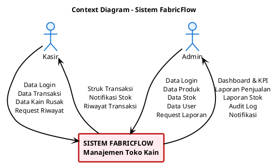
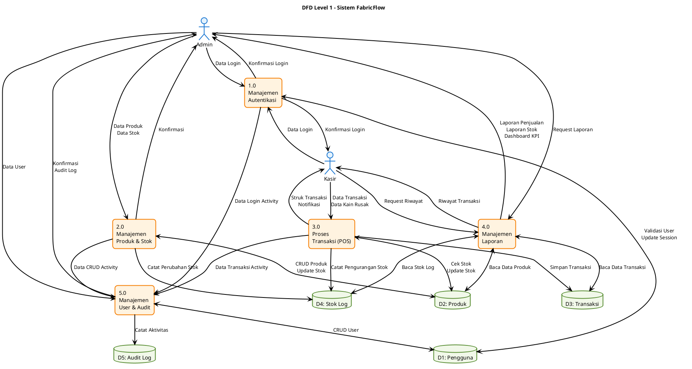

# Bagian 3 - Analisis Proses Sistem (20 poin)

## Pengantar

Data Flow Diagram (DFD) adalah representasi grafis dari aliran data dalam sistem informasi. DFD menunjukkan bagaimana data mengalir dari input, melalui proses, hingga menjadi output, serta bagaimana data disimpan dalam penyimpanan data.

Untuk sistem FabricFlow, DFD akan menggambarkan aliran data dari berbagai entitas eksternal (Admin, Kasir) melalui proses-proses bisnis utama (Transaksi, Manajemen Produk, Stok, Laporan) hingga tersimpan dalam database.

---

## 1. Context Diagram (Level 0 DFD)

### Deskripsi
Context Diagram menunjukkan sistem FabricFlow sebagai satu proses tunggal yang berinteraksi dengan entitas eksternal. Diagram ini memberikan gambaran umum tentang input dan output sistem tanpa menunjukkan detail internal.

### Entitas Eksternal:
1. **Admin** - Pengelola sistem dengan akses penuh
2. **Kasir** - Operator POS dengan akses terbatas

### Aliran Data:

**Input dari Admin:**
- Data login (email, password)
- Data produk (tambah, edit, hapus)
- Data stok adjustment
- Data user (tambah, edit)
- Request laporan

**Output ke Admin:**
- Konfirmasi login
- Dashboard & KPI
- Laporan penjualan
- Laporan stok
- Audit log
- Notifikasi stok menipis

**Input dari Kasir:**
- Data login
- Data transaksi penjualan
- Data kain rusak
- Request riwayat transaksi

**Output ke Kasir:**
- Konfirmasi login
- Struk transaksi
- Notifikasi stok
- Riwayat transaksi

### Script Diagram - PlantUML

**Cara Generate Gambar:**
1. Copy script PlantUML di atas
2. Buka https://www.plantuml.com/plantuml/uml/
3. Paste script ke editor
4. Klik "Submit" untuk generate
5. Download gambar PNG (klik kanan > Save Image)
6. Paste ke Word

---

## 2. Data Flow Diagram Level 1

### Deskripsi
DFD Level 1 memecah sistem menjadi 5 proses utama yang menunjukkan detail aliran data antar proses, entitas eksternal, dan data store.

### Proses Utama:

#### 1.0 Manajemen Autentikasi
- Login user (Admin/Kasir)
- Validasi kredensial
- Generate session token
- Logout

#### 2.0 Manajemen Produk & Stok
- CRUD produk kain
- Adjustment stok (masuk/keluar)
- Catat kain rusak
- Monitor stok rendah

#### 3.0 Proses Transaksi (POS)
- Tambah item ke keranjang
- Hitung total & diskon
- Proses pembayaran
- Generate struk
- Update stok otomatis

#### 4.0 Manajemen Laporan
- Generate laporan penjualan
- Generate laporan stok
- Analisis KPI
- Export data

#### 5.0 Manajemen User & Audit
- CRUD user (Admin only)
- Catat aktivitas user
- Monitor audit log

### Data Store:

- **D1: Pengguna** - Menyimpan data user (Admin, Kasir)
- **D2: Produk** - Menyimpan data produk kain
- **D3: Transaksi** - Menyimpan data transaksi penjualan
- **D4: Stok Log** - Menyimpan riwayat perubahan stok
- **D5: Audit Log** - Menyimpan log aktivitas user

### Script Diagram - PlantUML

**Cara Generate Gambar:**
1. Copy script PlantUML di atas
2. Buka https://www.plantuml.com/plantuml/uml/
3. Paste script ke editor
4. Klik "Submit" untuk generate
5. Download gambar PNG (klik kanan > Save Image)
6. Paste ke Word

---

## Penjelasan Detail Aliran Data

### 1.0 Manajemen Autentikasi
**Input:**
- Data login dari Admin/Kasir (email, password)

**Proses:**
- Validasi kredensial dengan D1: Pengguna
- Generate session token jika valid
- Catat aktivitas login ke P5

**Output:**
- Konfirmasi login (sukses/gagal)
- Session token

**Data Store:**
- Read: D1 (validasi user)
- Write: D5 (via P5 - log aktivitas)

---

### 2.0 Manajemen Produk & Stok
**Input:**
- Data produk dari Admin (nama, kode, harga, stok, kategori)
- Data adjustment stok (masuk/keluar)
- Data kain rusak dari Kasir

**Proses:**
- CRUD produk ke D2: Produk
- Update stok produk
- Catat perubahan stok ke D4: Stok Log
- Validasi stok minimum
- Catat aktivitas ke P5

**Output:**
- Konfirmasi operasi
- Notifikasi stok rendah

**Data Store:**
- Read/Write: D2 (data produk)
- Write: D4 (log perubahan stok)
- Write: D5 (via P5 - log aktivitas)

---

### 3.0 Proses Transaksi (POS)
**Input:**
- Data transaksi dari Admin/Kasir (produk, jumlah, diskon, metode bayar)

**Proses:**
- Validasi stok tersedia dari D2
- Hitung total & grand total
- Simpan transaksi ke D3: Transaksi
- Update stok produk di D2 (pengurangan)
- Catat perubahan stok ke D4
- Generate struk digital
- Catat aktivitas ke P5

**Output:**
- Struk transaksi
- Notifikasi sukses/gagal

**Data Store:**
- Read: D2 (cek stok)
- Write: D2 (update stok)
- Write: D3 (simpan transaksi)
- Write: D4 (log pengurangan stok)
- Write: D5 (via P5 - log aktivitas)

---

### 4.0 Manajemen Laporan
**Input:**
- Request laporan dari Admin/Kasir
- Filter tanggal, kategori, dll

**Proses:**
- Baca data dari D2, D3, D4
- Agregasi dan analisis data
- Hitung KPI (total penjualan, produk terlaris, dll)
- Generate laporan

**Output:**
- Laporan penjualan
- Laporan stok
- Dashboard KPI
- Riwayat transaksi

**Data Store:**
- Read: D2 (data produk)
- Read: D3 (data transaksi)
- Read: D4 (stok log)

---

### 5.0 Manajemen User & Audit
**Input:**
- Data user dari Admin (nama, email, password, role)
- Data aktivitas dari P1, P2, P3

**Proses:**
- CRUD user ke D1: Pengguna
- Catat semua aktivitas user ke D5: Audit Log
- Monitor aktivitas mencurigakan

**Output:**
- Konfirmasi operasi user
- Audit log report

**Data Store:**
- Read/Write: D1 (data user)
- Write: D5 (log aktivitas)

---

## Kesimpulan Bagian 3

DFD yang telah dibuat menunjukkan:

✅ **Context Diagram:**
- 2 entitas eksternal (Admin, Kasir)
- 1 sistem utama (FabricFlow)
- Aliran data input/output jelas

✅ **DFD Level 1:**
- 5 proses utama sesuai requirement
- 5 data store untuk persistensi
- Aliran data antar proses, entitas, dan data store
- Anak panah dengan label yang jelas

**Total: 20 poin** ✅

Diagram menggunakan PlantUML dengan background putih, cocok untuk print dan paste ke Word/PDF.

