# Bagian 3 - Analisis Proses Sistem (20 poin)

## Pengantar

Data Flow Diagram (DFD) adalah representasi grafis dari aliran data dalam sistem informasi. DFD menunjukkan bagaimana data mengalir dari input, melalui proses, hingga menjadi output, serta bagaimana data disimpan dalam penyimpanan data.

Untuk sistem FabricFlow, DFD akan menggambarkan aliran data dari berbagai entitas eksternal (Admin, Kasir) melalui proses-proses bisnis utama (Transaksi, Manajemen Produk, Stok, Laporan) hingga tersimpan dalam database.

---

## 1. Context Diagram (Level 0 DFD)

### Deskripsi
Context Diagram menunjukkan sistem FabricFlow sebagai satu proses tunggal yang berinteraksi dengan entitas eksternal. Diagram ini memberikan gambaran umum tentang input dan output sistem tanpa menunjukkan detail internal.

### Entitas Eksternal:
1. **Admin** - Pengelola sistem dengan akses penuh
2. **Kasir** - Operator POS dengan akses terbatas
3. **Sistem Eksternal** - Untuk notifikasi dan backup (future)

### Aliran Data:

**Input dari Admin:**
- Data login (email, password)
- Data produk (tambah, edit, hapus)
- Data stok adjustment
- Data user (tambah, edit)
- Request laporan

**Output ke Admin:**
- Konfirmasi login
- Dashboard & KPI
- Laporan penjualan
- Laporan stok
- Audit log
- Notifikasi stok menipis

**Input dari Kasir:**
- Data login
- Data transaksi penjualan
- Data kain rusak
- Request riwayat transaksi

**Output ke Kasir:**
- Konfirmasi login
- Struk transaksi
- Notifikasi stok
- Riwayat transaksi

### Script Diagram - Mermaid

```mermaid
graph TB
    subgraph External["Entitas Eksternal"]
        Admin["👤 Admin"]
        Kasir["👤 Kasir"]
    end
    
    System["🖥️ SISTEM FABRICFLOW<br/>Manajemen Toko Kain"]
    
    Admin -->|"Data Login<br/>Data Produk<br/>Data Stok<br/>Data User<br/>Request Laporan"| System
    System -->|"Dashboard & KPI<br/>Laporan Penjualan<br/>Laporan Stok<br/>Audit Log<br/>Notifikasi"| Admin
    
    Kasir -->|"Data Login<br/>Data Transaksi<br/>Data Kain Rusak<br/>Request Riwayat"| System
    System -->|"Struk Transaksi<br/>Notifikasi Stok<br/>Riwayat Transaksi"| Kasir
    
    style System fill:#8B0000,stroke:#ff0040,stroke-width:3px,color:#fff
    style Admin fill:#1a237e,stroke:#00d4ff,stroke-width:2px,color:#fff
    style Kasir fill:#1a237e,stroke:#00d4ff,stroke-width:2px,color:#fff
```

### Script Diagram - PlantUML

---

## 2. Data Flow Diagram Level 1

### Deskripsi
DFD Level 1 memecah sistem FabricFlow menjadi proses-proses utama yang lebih detail. Setiap proses menunjukkan fungsi bisnis spesifik dengan aliran data masuk dan keluar, serta interaksi dengan data store.

### Proses Utama:

#### Proses 1.0: Autentikasi & Manajemen User
**Fungsi:** Mengelola login, logout, dan data user
**Input:** Data login, data user baru
**Output:** Konfirmasi login, session token, data user
**Data Store:** D1 (User), D7 (Audit Log)

#### Proses 2.0: Manajemen Produk & Stok
**Fungsi:** Mengelola CRUD produk dan adjustment stok
**Input:** Data produk, data stok adjustment
**Output:** Konfirmasi operasi, notifikasi stok menipis
**Data Store:** D2 (Produk), D5 (Stok Log), D7 (Audit Log)

#### Proses 3.0: Transaksi Penjualan (POS)
**Fungsi:** Memproses transaksi penjualan di kasir
**Input:** Data transaksi (items, diskon, metode bayar)
**Output:** Struk transaksi, update stok
**Data Store:** D2 (Produk), D3 (Transaksi), D4 (Transaksi Item), D5 (Stok Log), D7 (Audit Log)

#### Proses 4.0: Pencatatan Kain Rusak
**Fungsi:** Mencatat kain yang rusak/cacat
**Input:** Data kain rusak (produk, jumlah, alasan, foto)
**Output:** Konfirmasi pencatatan, update stok
**Data Store:** D2 (Produk), D6 (Kain Rusak), D5 (Stok Log), D7 (Audit Log)

#### Proses 5.0: Laporan & Analisis
**Fungsi:** Generate dashboard dan laporan penjualan
**Input:** Request laporan, filter periode
**Output:** Dashboard KPI, grafik penjualan, laporan stok
**Data Store:** D2 (Produk), D3 (Transaksi), D4 (Transaksi Item), D5 (Stok Log), D6 (Kain Rusak)

### Data Store:
- **D1: User** - Data pengguna (admin, kasir)
- **D2: Produk** - Data produk kain
- **D3: Transaksi** - Header transaksi penjualan
- **D4: Transaksi Item** - Detail item transaksi
- **D5: Stok Log** - Riwayat perubahan stok
- **D6: Kain Rusak** - Data kain rusak/cacat
- **D7: Audit Log** - Log aktivitas user

### Script Diagram - Mermaid

```mermaid
graph TB
    subgraph External["Entitas Eksternal"]
        Admin["👤 Admin"]
        Kasir["👤 Kasir"]
    end
    
    subgraph Processes["Proses Sistem"]
        P1["1.0<br/>Autentikasi &<br/>Manajemen User"]
        P2["2.0<br/>Manajemen<br/>Produk & Stok"]
        P3["3.0<br/>Transaksi<br/>Penjualan POS"]
        P4["4.0<br/>Pencatatan<br/>Kain Rusak"]
        P5["5.0<br/>Laporan &<br/>Analisis"]
    end
    
    subgraph DataStores["Data Store"]
        D1[("D1<br/>User")]
        D2[("D2<br/>Produk")]
        D3[("D3<br/>Transaksi")]
        D4[("D4<br/>Transaksi<br/>Item")]
        D5[("D5<br/>Stok Log")]
        D6[("D6<br/>Kain<br/>Rusak")]
        D7[("D7<br/>Audit Log")]
    end
    
    %% Admin flows
    Admin -->|"Data Login"| P1
    P1 -->|"Konfirmasi Login<br/>Session Token"| Admin
    Admin -->|"Data User"| P1
    P1 -->|"Data User"| Admin
    
    Admin -->|"Data Produk<br/>Data Stok"| P2
    P2 -->|"Konfirmasi<br/>Notifikasi Stok"| Admin
    
    Admin -->|"Request Laporan"| P5
    P5 -->|"Dashboard<br/>Laporan"| Admin
    
    %% Kasir flows
    Kasir -->|"Data Login"| P1
    P1 -->|"Konfirmasi Login"| Kasir
    
    Kasir -->|"Data Transaksi"| P3
    P3 -->|"Struk Transaksi"| Kasir
    
    Kasir -->|"Data Kain Rusak"| P4
    P4 -->|"Konfirmasi"| Kasir
    
    %% Process to Data Store
    P1 <-->|"Read/Write"| D1
    P1 -->|"Log Aktivitas"| D7
    
    P2 <-->|"CRUD Produk"| D2
    P2 -->|"Log Stok"| D5
    P2 -->|"Log Aktivitas"| D7
    
    P3 -->|"Baca Produk"| D2
    P3 -->|"Update Stok"| D2
    P3 -->|"Simpan Transaksi"| D3
    P3 -->|"Simpan Item"| D4
    P3 -->|"Log Stok"| D5
    P3 -->|"Log Aktivitas"| D7
    
    P4 -->|"Update Stok"| D2
    P4 -->|"Simpan Rusak"| D6
    P4 -->|"Log Stok"| D5
    P4 -->|"Log Aktivitas"| D7
    
    P5 -->|"Baca Data"| D2
    P5 -->|"Baca Data"| D3
    P5 -->|"Baca Data"| D4
    P5 -->|"Baca Data"| D5
    P5 -->|"Baca Data"| D6
    
    style P1 fill:#8B0000,stroke:#ff0040,stroke-width:2px,color:#fff
    style P2 fill:#8B0000,stroke:#ff0040,stroke-width:2px,color:#fff
    style P3 fill:#8B0000,stroke:#ff0040,stroke-width:2px,color:#fff
    style P4 fill:#8B0000,stroke:#ff0040,stroke-width:2px,color:#fff
    style P5 fill:#8B0000,stroke:#ff0040,stroke-width:2px,color:#fff
    
    style D1 fill:#1a237e,stroke:#00d4ff,stroke-width:2px,color:#fff
    style D2 fill:#1a237e,stroke:#00d4ff,stroke-width:2px,color:#fff
    style D3 fill:#1a237e,stroke:#00d4ff,stroke-width:2px,color:#fff
    style D4 fill:#1a237e,stroke:#00d4ff,stroke-width:2px,color:#fff
    style D5 fill:#1a237e,stroke:#00d4ff,stroke-width:2px,color:#fff
    style D6 fill:#1a237e,stroke:#00d4ff,stroke-width:2px,color:#fff
    style D7 fill:#1a237e,stroke:#00d4ff,stroke-width:2px,color:#fff
```

### Script Diagram - PlantUML (Lebih Detail)

---

## 3. Penjelasan Detail Setiap Proses

### Proses 1.0: Autentikasi & Manajemen User

**Deskripsi:**
Proses ini menangani autentikasi user (login/logout) dan manajemen data user oleh admin.

**Aliran Data:**
1. User (Admin/Kasir) input email dan password
2. Sistem validasi kredensial dengan data di D1 (User)
3. Jika valid, sistem generate session token
4. Sistem catat aktivitas login ke D7 (Audit Log)
5. Sistem return konfirmasi login dan data user

**Untuk Manajemen User (Admin only):**
1. Admin input data user baru (nama, email, password, role)
2. Sistem validasi (email unique, password strength)
3. Sistem simpan ke D1 (User)
4. Sistem catat ke D7 (Audit Log)
5. Return konfirmasi

**File Implementasi:** `authStore.js`, `Login.jsx`, `Pengguna.jsx`

---

### Proses 2.0: Manajemen Produk & Stok

**Deskripsi:**
Proses ini menangani CRUD produk dan adjustment stok oleh admin.

**Aliran Data - Manajemen Produk:**
1. Admin input data produk (kode, nama, kategori, harga, stok, dll)
2. Sistem validasi input
3. Sistem simpan/update/delete ke D2 (Produk)
4. Sistem catat ke D7 (Audit Log)
5. Return konfirmasi

**Aliran Data - Adjustment Stok:**
1. Admin pilih produk dan input adjustment (masuk/keluar, jumlah, catatan)
2. Sistem validasi (stok tidak boleh negatif)
3. Sistem update stok di D2 (Produk)
4. Sistem catat perubahan ke D5 (Stok Log)
5. Sistem catat ke D7 (Audit Log)
6. Jika stok < 10, sistem generate notifikasi
7. Return konfirmasi dan notifikasi

**File Implementasi:** `produkStore.js`, `Produk.jsx`, `Stok.jsx`

---

### Proses 3.0: Transaksi Penjualan (POS)

**Deskripsi:**
Proses ini menangani transaksi penjualan di kasir (Point of Sale).

**Aliran Data:**
1. Kasir pilih produk dari D2 (Produk)
2. Kasir input jumlah dan tambah ke keranjang
3. Sistem validasi stok tersedia
4. Kasir input diskon dan pilih metode pembayaran
5. Kasir proses transaksi
6. Sistem generate nomor transaksi (TRX-YYYYMMDD-XXX)
7. Sistem hitung total (subtotal - diskon)
8. Sistem simpan header transaksi ke D3 (Transaksi)
9. Sistem simpan detail items ke D4 (Transaksi Item)
10. Sistem update stok produk di D2 (Produk)
11. Sistem catat perubahan stok ke D5 (Stok Log) dengan tipe "penjualan"
12. Sistem catat aktivitas ke D7 (Audit Log)
13. Sistem generate struk digital
14. Return struk ke kasir

**File Implementasi:** `transaksiStore.js`, `Kasir.jsx`, `Transaksi.jsx`

---

### Proses 4.0: Pencatatan Kain Rusak

**Deskripsi:**
Proses ini menangani pencatatan kain yang rusak/cacat.

**Aliran Data:**
1. User (Kasir/Admin) pilih produk dari D2 (Produk)
2. User input jumlah rusak, alasan, dan foto bukti (optional)
3. Sistem validasi (jumlah tidak melebihi stok)
4. Sistem generate ID record kain rusak
5. Sistem simpan data ke D6 (Kain Rusak)
6. Sistem kurangi stok produk di D2 (Produk)
7. Sistem catat perubahan stok ke D5 (Stok Log) dengan tipe "rusak"
8. Sistem catat aktivitas ke D7 (Audit Log)
9. Return konfirmasi

**File Implementasi:** `KainRusak.jsx`, `produkStore.js`

---

### Proses 5.0: Laporan & Analisis

**Deskripsi:**
Proses ini menangani pembuatan dashboard dan laporan penjualan.

**Aliran Data - Dashboard:**
1. Admin request dashboard
2. Sistem query data dari:
   - D2 (Produk) → Total produk, stok menipis
   - D3 (Transaksi) → Total penjualan hari ini, jumlah transaksi
   - D4 (Transaksi Item) → Produk terlaris
   - D5 (Stok Log) → Riwayat perubahan stok
3. Sistem hitung KPI (total penjualan, rata-rata transaksi, dll)
4. Sistem generate grafik (penjualan 7 hari, kategori terlaris, dll)
5. Return dashboard dengan visualisasi

**Aliran Data - Laporan:**
1. Admin request laporan dengan filter periode
2. Sistem query data sesuai periode dari D3, D4, D5, D6
3. Sistem generate grafik analisis:
   - Area chart: Trend penjualan
   - Pie chart: Distribusi stok per kategori
   - Bar chart: Produk terlaris
   - Radial chart: Target vs realisasi
4. Sistem hitung statistik (total, rata-rata, growth)
5. Return laporan dengan visualisasi

**File Implementasi:** `Dashboard.jsx`, `Laporan.jsx`, `transaksiStore.js`, `produkStore.js`

---

## 4. Kamus Data (Data Dictionary)

### Aliran Data:

| Nama Aliran | Deskripsi | Struktur Data |
|-------------|-----------|---------------|
| **Data Login** | Kredensial user untuk autentikasi | email + password |
| **Data User** | Informasi user lengkap | id + nama + email + password + peran + aktif + tanggalDibuat |
| **Data Produk** | Informasi produk kain | id + kode + nama + kategori + warna + harga + stok + satuan + foto + deskripsi |
| **Data Stok Adjustment** | Data perubahan stok manual | produkId + tipe + jumlah + catatan + penggunaId |
| **Data Transaksi** | Data transaksi penjualan | items[] + diskon + metodeBayar + penggunaId |
| **Data Kain Rusak** | Data kain rusak/cacat | produkId + jumlah + alasan + foto + penggunaId |
| **Request Laporan** | Permintaan laporan dengan filter | periode + tanggalMulai + tanggalAkhir |
| **Struk Transaksi** | Bukti transaksi | nomor + tanggal + items[] + total + diskon + grandTotal + metodeBayar + kasir |
| **Dashboard** | Data KPI dan grafik | totalPenjualan + totalTransaksi + totalProduk + stokMenipis + grafik[] |
| **Notifikasi** | Pesan notifikasi ke user | tipe + judul + pesan + timestamp |

### Data Store:

| Data Store | Deskripsi | Atribut |
|------------|-----------|---------|
| **D1: User** | Data pengguna sistem | id, nama, email, password, peran, aktif, tanggalDibuat |
| **D2: Produk** | Data produk kain | id, kode, nama, kategori, warna, harga, stok, satuan, foto, deskripsi |
| **D3: Transaksi** | Header transaksi | id, nomor, tanggal, penggunaId, namaPengguna, total, diskon, grandTotal, metodeBayar, status |
| **D4: Transaksi Item** | Detail item transaksi | id, transaksiId, produkId, namaProduk, jumlah, hargaSatuan, subtotal |
| **D5: Stok Log** | Riwayat perubahan stok | id, produkId, namaProduk, jumlah, stokSebelum, stokSesudah, tipe, referensi, penggunaId, namaPengguna, catatan, tanggal |
| **D6: Kain Rusak** | Data kain rusak | id, produkId, namaProduk, kodeProduk, jumlah, alasan, foto, penggunaId, namaPengguna, tanggal |
| **D7: Audit Log** | Log aktivitas user | id, penggunaId, namaPengguna, aksi, tabel, dataId, dataBaru, dataLama, tanggal |

---

## Kesimpulan

DFD Level 0 dan Level 1 FabricFlow menunjukkan aliran data yang jelas dan terstruktur dari entitas eksternal (Admin, Kasir) melalui 5 proses utama (Autentikasi, Manajemen Produk & Stok, Transaksi POS, Kain Rusak, Laporan) dengan 7 data store yang saling terintegrasi. Setiap proses memiliki input, output, dan interaksi dengan data store yang terdefinisi dengan baik, memastikan sistem dapat berjalan efisien dan akurat.
