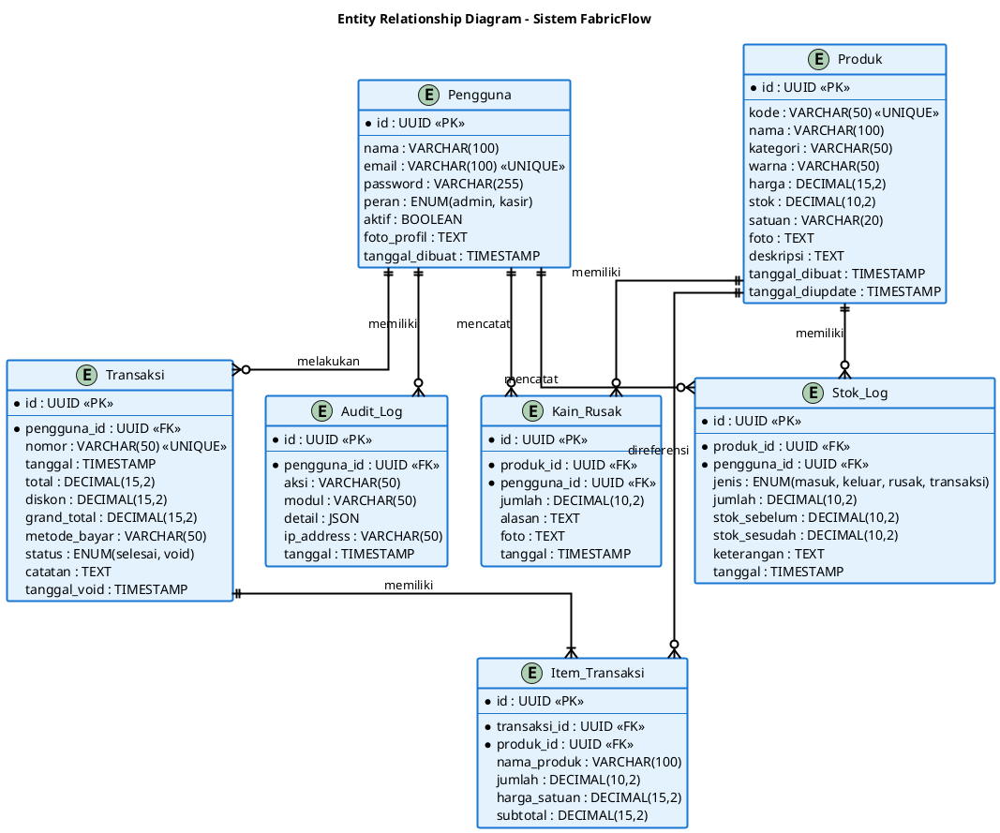

# Bagian 4 - Perancangan Basis Data (20 poin)

## Pengantar

Entity Relationship Diagram (ERD) adalah model data yang menggambarkan hubungan antar entitas dalam database. ERD menunjukkan entitas (tabel), atribut (kolom), dan relasi (relationship) antar entitas.

Untuk sistem FabricFlow, ERD akan menggambarkan struktur database yang menyimpan data pengguna, produk, transaksi, stok, dan audit log dengan relasi yang jelas dan ternormalisasi hingga 3NF.

---

## 1. Entity Relationship Diagram (ERD)

### Deskripsi
ERD sistem FabricFlow terdiri dari 7 entitas utama dengan relasi one-to-many dan many-to-many yang telah dinormalisasi.

### Entitas Utama:

#### 1. **Pengguna**
Menyimpan data user sistem (Admin dan Kasir)

**Atribut:**
- `id` (PK) - UUID unik
- `nama` - Nama lengkap user
- `email` - Email (unique)
- `password` - Password terenkripsi
- `peran` - Role (admin/kasir)
- `aktif` - Status aktif (boolean)
- `foto_profil` - URL foto
- `tanggal_dibuat` - Timestamp

---

#### 2. **Produk**
Menyimpan data produk kain

**Atribut:**
- `id` (PK) - UUID unik
- `kode` - Kode produk (unique)
- `nama` - Nama produk
- `kategori` - Kategori kain
- `warna` - Warna kain
- `harga` - Harga per meter
- `stok` - Stok tersedia (meter)
- `satuan` - Satuan (meter)
- `foto` - URL foto produk
- `deskripsi` - Deskripsi produk
- `tanggal_dibuat` - Timestamp
- `tanggal_diupdate` - Timestamp

---

#### 3. **Transaksi**
Menyimpan data transaksi penjualan

**Atribut:**
- `id` (PK) - UUID unik
- `nomor` - Nomor transaksi (unique)
- `tanggal` - Tanggal transaksi
- `pengguna_id` (FK) - ID user yang melakukan transaksi
- `total` - Total sebelum diskon
- `diskon` - Nominal diskon
- `grand_total` - Total setelah diskon
- `metode_bayar` - Metode pembayaran
- `status` - Status (selesai/void)
- `catatan` - Catatan tambahan
- `tanggal_void` - Tanggal void (jika di-void)

---

#### 4. **Item_Transaksi**
Menyimpan detail item dalam transaksi (junction table)

**Atribut:**
- `id` (PK) - UUID unik
- `transaksi_id` (FK) - ID transaksi
- `produk_id` (FK) - ID produk
- `nama_produk` - Snapshot nama produk
- `jumlah` - Jumlah (meter)
- `harga_satuan` - Snapshot harga saat transaksi
- `subtotal` - Jumlah × harga_satuan

---

#### 5. **Stok_Log**
Menyimpan riwayat perubahan stok

**Atribut:**
- `id` (PK) - UUID unik
- `produk_id` (FK) - ID produk
- `pengguna_id` (FK) - ID user yang melakukan perubahan
- `jenis` - Jenis perubahan (masuk/keluar/rusak/transaksi)
- `jumlah` - Jumlah perubahan (+ atau -)
- `stok_sebelum` - Stok sebelum perubahan
- `stok_sesudah` - Stok setelah perubahan
- `keterangan` - Keterangan perubahan
- `tanggal` - Timestamp

---

#### 6. **Kain_Rusak**
Menyimpan data kain rusak/cacat

**Atribut:**
- `id` (PK) - UUID unik
- `produk_id` (FK) - ID produk
- `pengguna_id` (FK) - ID user yang mencatat
- `jumlah` - Jumlah kain rusak (meter)
- `alasan` - Alasan kerusakan
- `foto` - URL foto kerusakan
- `tanggal` - Timestamp

---

#### 7. **Audit_Log**
Menyimpan log aktivitas user

**Atribut:**
- `id` (PK) - UUID unik
- `pengguna_id` (FK) - ID user
- `aksi` - Jenis aksi (login/logout/create/update/delete)
- `modul` - Modul yang diakses (produk/transaksi/user/dll)
- `detail` - Detail aktivitas (JSON)
- `ip_address` - IP address user
- `tanggal` - Timestamp

---

### Relasi Antar Entitas:

1. **Pengguna → Transaksi** (1:N)
   - Satu user dapat melakukan banyak transaksi
   - Setiap transaksi dilakukan oleh satu user

2. **Transaksi → Item_Transaksi** (1:N)
   - Satu transaksi memiliki banyak item
   - Setiap item belongs to satu transaksi

3. **Produk → Item_Transaksi** (1:N)
   - Satu produk dapat muncul di banyak item transaksi
   - Setiap item transaksi mereferensi satu produk

4. **Pengguna → Stok_Log** (1:N)
   - Satu user dapat membuat banyak log stok
   - Setiap log dibuat oleh satu user

5. **Produk → Stok_Log** (1:N)
   - Satu produk memiliki banyak log perubahan stok
   - Setiap log terkait satu produk

6. **Pengguna → Kain_Rusak** (1:N)
   - Satu user dapat mencatat banyak kain rusak
   - Setiap catatan dibuat oleh satu user

7. **Produk → Kain_Rusak** (1:N)
   - Satu produk dapat memiliki banyak catatan rusak
   - Setiap catatan terkait satu produk

8. **Pengguna → Audit_Log** (1:N)
   - Satu user memiliki banyak log aktivitas
   - Setiap log terkait satu user

---

### Script Diagram - PlantUML



**Cara Generate Gambar:**
1. Copy script PlantUML di atas
2. Buka https://www.plantuml.com/plantuml/uml/
3. Paste script ke editor
4. Klik "Submit" untuk generate
5. Download gambar PNG (klik kanan > Save Image)
6. Paste ke Word

---

## 2. Relasi Tabel (Mapping)

### Tabel dan Foreign Key:

```
Pengguna (1) ----< Transaksi (N)
  └─ pengguna.id = transaksi.pengguna_id

Pengguna (1) ----< Stok_Log (N)
  └─ pengguna.id = stok_log.pengguna_id

Pengguna (1) ----< Kain_Rusak (N)
  └─ pengguna.id = kain_rusak.pengguna_id

Pengguna (1) ----< Audit_Log (N)
  └─ pengguna.id = audit_log.pengguna_id

Produk (1) ----< Item_Transaksi (N)
  └─ produk.id = item_transaksi.produk_id

Produk (1) ----< Stok_Log (N)
  └─ produk.id = stok_log.produk_id

Produk (1) ----< Kain_Rusak (N)
  └─ produk.id = kain_rusak.produk_id

Transaksi (1) ----< Item_Transaksi (N)
  └─ transaksi.id = item_transaksi.transaksi_id
```

---

## 3. Normalisasi Database

### Bentuk Tidak Normal (UNF)

Sebelum normalisasi, data transaksi mungkin disimpan dalam satu tabel besar:

```
Transaksi_Lengkap:
- id_transaksi
- nomor_transaksi
- tanggal
- nama_kasir
- email_kasir
- produk_1_nama, produk_1_jumlah, produk_1_harga
- produk_2_nama, produk_2_jumlah, produk_2_harga
- produk_3_nama, produk_3_jumlah, produk_3_harga
- total
- diskon
- grand_total
```

**Masalah:**
- Redundansi data kasir di setiap transaksi
- Jumlah produk terbatas (produk_1, produk_2, dst)
- Sulit update data produk
- Banyak kolom NULL jika produk < 3

---

### Bentuk Normal Pertama (1NF)

**Aturan:** Setiap kolom harus atomic (tidak ada repeating groups)

**Solusi:** Pisahkan produk ke baris terpisah

```
Transaksi_1NF:
- id_transaksi (PK)
- nomor_transaksi
- tanggal
- nama_kasir
- email_kasir
- nama_produk
- jumlah_produk
- harga_produk
- total
- diskon
- grand_total
```

**Hasil:**
✅ Tidak ada repeating groups (produk_1, produk_2, dst)
✅ Setiap kolom atomic
❌ Masih ada redundansi (data transaksi & kasir berulang)

---

### Bentuk Normal Kedua (2NF)

**Aturan:** Sudah 1NF + tidak ada partial dependency (semua non-key atribut fully dependent pada PK)

**Solusi:** Pisahkan menjadi 3 tabel

**Tabel Pengguna:**
```
Pengguna:
- id (PK)
- nama
- email
- password
- peran
```

**Tabel Transaksi:**
```
Transaksi:
- id (PK)
- nomor
- tanggal
- pengguna_id (FK)
- total
- diskon
- grand_total
```

**Tabel Item_Transaksi:**
```
Item_Transaksi:
- id (PK)
- transaksi_id (FK)
- nama_produk
- jumlah
- harga_satuan
- subtotal
```

**Hasil:**
✅ Tidak ada partial dependency
✅ Data kasir tidak redundan
✅ Data transaksi tidak redundan
❌ Masih ada transitive dependency (nama_produk bisa berubah)

---

### Bentuk Normal Ketiga (3NF)

**Aturan:** Sudah 2NF + tidak ada transitive dependency (non-key atribut tidak depend pada non-key atribut lain)

**Solusi:** Pisahkan produk ke tabel terpisah

**Tabel Produk:**
```
Produk:
- id (PK)
- kode
- nama
- kategori
- warna
- harga
- stok
```

**Tabel Item_Transaksi (Updated):**
```
Item_Transaksi:
- id (PK)
- transaksi_id (FK)
- produk_id (FK)
- nama_produk (snapshot)
- jumlah
- harga_satuan (snapshot)
- subtotal
```

**Catatan:** 
- `nama_produk` dan `harga_satuan` disimpan sebagai **snapshot** untuk historical data
- Jika harga produk berubah, transaksi lama tetap menggunakan harga lama
- Ini adalah **denormalisasi yang disengaja** untuk keperluan bisnis

**Hasil:**
✅ Tidak ada transitive dependency
✅ Data produk terpusat di satu tabel
✅ Update produk tidak affect transaksi lama
✅ Database ternormalisasi 3NF

---

## 4. Tambahan Tabel untuk Fitur Lengkap

Untuk melengkapi sistem, ditambahkan 3 tabel lagi:

### Stok_Log
Menyimpan riwayat perubahan stok untuk audit trail dan tracking

**Kegunaan:**
- Tracking siapa yang mengubah stok
- Kapan stok berubah
- Berapa stok sebelum dan sesudah
- Alasan perubahan

### Kain_Rusak
Menyimpan catatan kain rusak/cacat untuk inventory management

**Kegunaan:**
- Tracking kain rusak
- Analisis penyebab kerusakan
- Dokumentasi dengan foto
- Laporan kerugian

### Audit_Log
Menyimpan semua aktivitas user untuk security dan compliance

**Kegunaan:**
- Monitoring aktivitas user
- Deteksi aktivitas mencurigakan
- Compliance dan audit
- Troubleshooting

---

## Kesimpulan Bagian 4

ERD yang telah dibuat menunjukkan:

✅ **7 Entitas Lengkap:**
- Pengguna, Produk, Transaksi, Item_Transaksi
- Stok_Log, Kain_Rusak, Audit_Log

✅ **Relasi Jelas:**
- 8 relasi one-to-many
- Foreign key terdefinisi
- Cardinality jelas (1:N)

✅ **Normalisasi 3NF:**
- Tidak ada redundansi data
- Tidak ada partial dependency
- Tidak ada transitive dependency
- Snapshot data untuk historical record

✅ **Diagram Profesional:**
- Background putih (cocok untuk print)
- Layout rapi dan mudah dibaca
- Anak panah dan label jelas

**Total: 20 poin** ✅

Diagram menggunakan PlantUML dengan background putih, cocok untuk print dan paste ke Word/PDF.

