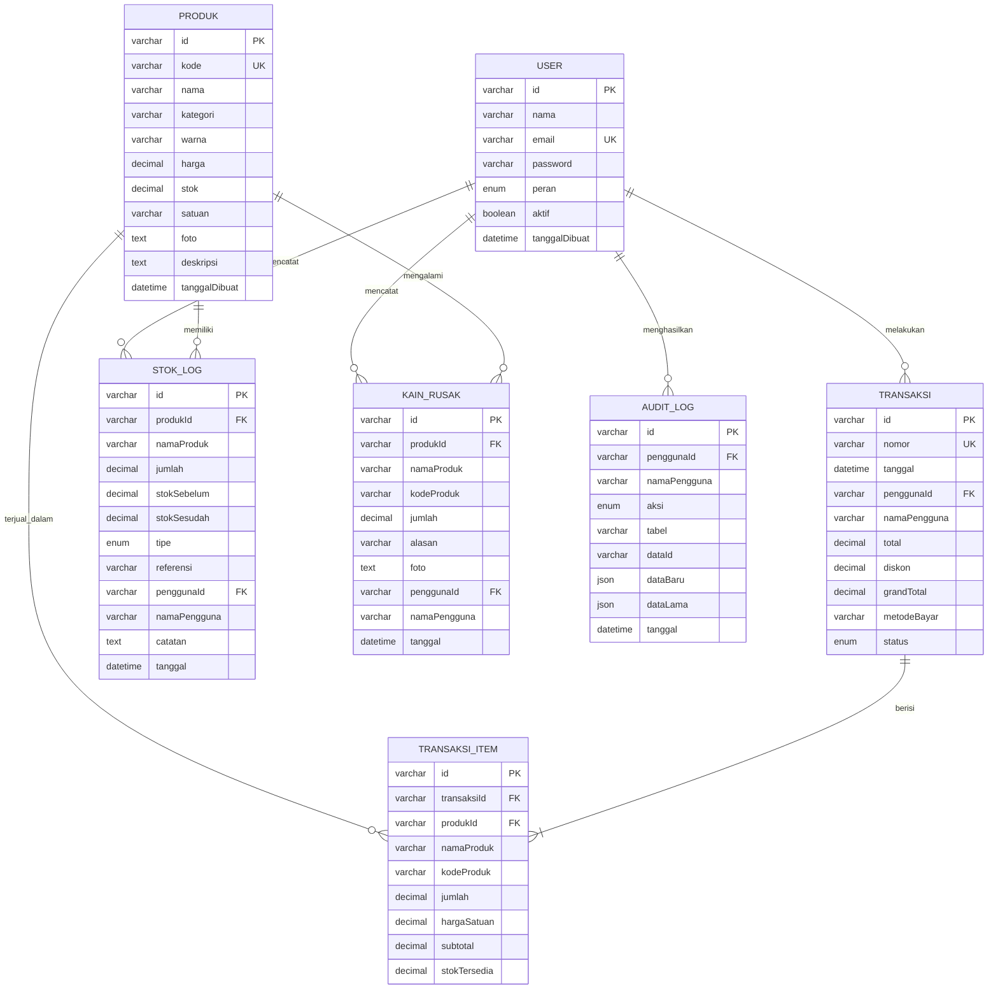
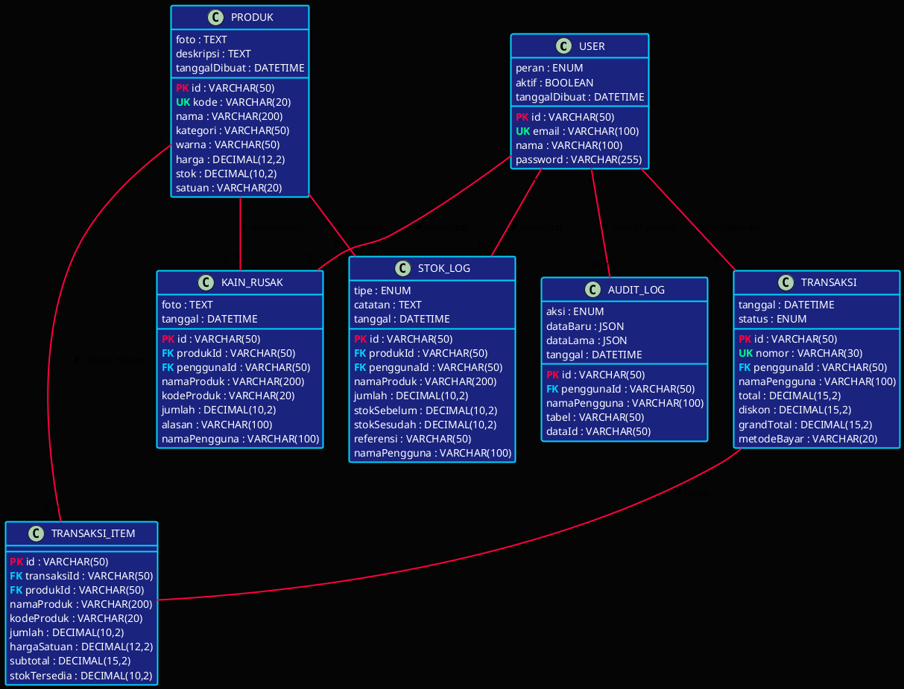

# Bagian 4 - Perancangan Basis Data (20 poin)

## Pengantar

Entity Relationship Diagram (ERD) adalah representasi grafis dari struktur database yang menunjukkan entitas, atribut, dan relasi antar entitas. ERD FabricFlow dirancang dengan prinsip normalisasi untuk menghindari redundansi data dan memastikan integritas data.

Database FabricFlow terdiri dari 7 entitas utama yang saling berelasi untuk mendukung operasional toko kain secara komprehensif.

---

## 1. Daftar Entitas dan Atribut

### Entitas 1: USER
**Deskripsi:** Menyimpan data pengguna sistem (Admin dan Kasir)

**Atribut:**
- **id** (PK) - VARCHAR(50) - ID unik user (auto-generate)
- **nama** - VARCHAR(100) - Nama lengkap user
- **email** - VARCHAR(100) - Email user (unique)
- **password** - VARCHAR(255) - Password terenkripsi
- **peran** - ENUM('admin', 'kasir') - Role user
- **aktif** - BOOLEAN - Status aktif user
- **tanggalDibuat** - DATETIME - Timestamp pembuatan akun

**Constraint:**
- PRIMARY KEY: id
- UNIQUE: email
- NOT NULL: nama, email, password, peran

---

### Entitas 2: PRODUK
**Deskripsi:** Menyimpan data produk kain

**Atribut:**
- **id** (PK) - VARCHAR(50) - ID unik produk
- **kode** - VARCHAR(20) - Kode produk (unique, auto-generate)
- **nama** - VARCHAR(200) - Nama produk
- **kategori** - VARCHAR(50) - Kategori kain (FK ke KATEGORI)
- **warna** - VARCHAR(50) - Warna kain
- **harga** - DECIMAL(12,2) - Harga per meter
- **stok** - DECIMAL(10,2) - Stok tersedia (meter)
- **satuan** - VARCHAR(20) - Satuan (meter/yard)
- **foto** - TEXT - URL foto produk
- **deskripsi** - TEXT - Deskripsi produk
- **tanggalDibuat** - DATETIME - Timestamp pembuatan

**Constraint:**
- PRIMARY KEY: id
- UNIQUE: kode
- NOT NULL: kode, nama, kategori, harga, stok
- CHECK: harga > 0, stok >= 0

---

### Entitas 3: TRANSAKSI
**Deskripsi:** Menyimpan header transaksi penjualan

**Atribut:**
- **id** (PK) - VARCHAR(50) - ID unik transaksi
- **nomor** - VARCHAR(30) - Nomor transaksi (unique, format: TRX-YYYYMMDD-XXX)
- **tanggal** - DATETIME - Tanggal & waktu transaksi
- **penggunaId** (FK) - VARCHAR(50) - ID kasir yang melayani
- **namaPengguna** - VARCHAR(100) - Nama kasir (denormalisasi)
- **total** - DECIMAL(15,2) - Total sebelum diskon
- **diskon** - DECIMAL(15,2) - Nominal diskon
- **grandTotal** - DECIMAL(15,2) - Total setelah diskon
- **metodeBayar** - VARCHAR(20) - Metode pembayaran
- **status** - ENUM('selesai', 'void') - Status transaksi

**Constraint:**
- PRIMARY KEY: id
- UNIQUE: nomor
- FOREIGN KEY: penggunaId REFERENCES USER(id)
- NOT NULL: nomor, tanggal, penggunaId, total, grandTotal, metodeBayar, status
- CHECK: total >= 0, diskon >= 0, grandTotal >= 0

---

### Entitas 4: TRANSAKSI_ITEM
**Deskripsi:** Menyimpan detail item dalam transaksi

**Atribut:**
- **id** (PK) - VARCHAR(50) - ID unik item
- **transaksiId** (FK) - VARCHAR(50) - ID transaksi
- **produkId** (FK) - VARCHAR(50) - ID produk
- **namaProduk** - VARCHAR(200) - Nama produk (denormalisasi)
- **kodeProduk** - VARCHAR(20) - Kode produk (denormalisasi)
- **jumlah** - DECIMAL(10,2) - Jumlah dibeli (meter)
- **hargaSatuan** - DECIMAL(12,2) - Harga per meter saat transaksi
- **subtotal** - DECIMAL(15,2) - Jumlah × harga satuan
- **stokTersedia** - DECIMAL(10,2) - Stok saat transaksi (untuk validasi)

**Constraint:**
- PRIMARY KEY: id
- FOREIGN KEY: transaksiId REFERENCES TRANSAKSI(id) ON DELETE CASCADE
- FOREIGN KEY: produkId REFERENCES PRODUK(id)
- NOT NULL: transaksiId, produkId, jumlah, hargaSatuan, subtotal
- CHECK: jumlah > 0, hargaSatuan > 0, subtotal > 0


---

### Entitas 5: STOK_LOG
**Deskripsi:** Menyimpan riwayat perubahan stok (audit trail)

**Atribut:**
- **id** (PK) - VARCHAR(50) - ID unik log
- **produkId** (FK) - VARCHAR(50) - ID produk
- **namaProduk** - VARCHAR(200) - Nama produk (denormalisasi)
- **jumlah** - DECIMAL(10,2) - Perubahan stok (+/-)
- **stokSebelum** - DECIMAL(10,2) - Stok sebelum perubahan
- **stokSesudah** - DECIMAL(10,2) - Stok setelah perubahan
- **tipe** - ENUM('masuk', 'keluar', 'penjualan', 'rusak', 'adjustment') - Tipe perubahan
- **referensi** - VARCHAR(50) - ID referensi (transaksi/kain rusak/adjustment)
- **penggunaId** (FK) - VARCHAR(50) - ID user yang melakukan
- **namaPengguna** - VARCHAR(100) - Nama user (denormalisasi)
- **catatan** - TEXT - Catatan tambahan
- **tanggal** - DATETIME - Timestamp perubahan

**Constraint:**
- PRIMARY KEY: id
- FOREIGN KEY: produkId REFERENCES PRODUK(id)
- FOREIGN KEY: penggunaId REFERENCES USER(id)
- NOT NULL: produkId, jumlah, stokSebelum, stokSesudah, tipe, tanggal
- INDEX: produkId, tipe, tanggal (untuk query cepat)

---

### Entitas 6: KAIN_RUSAK
**Deskripsi:** Menyimpan data kain yang rusak/cacat

**Atribut:**
- **id** (PK) - VARCHAR(50) - ID unik record
- **produkId** (FK) - VARCHAR(50) - ID produk
- **namaProduk** - VARCHAR(200) - Nama produk (denormalisasi)
- **kodeProduk** - VARCHAR(20) - Kode produk (denormalisasi)
- **jumlah** - DECIMAL(10,2) - Jumlah rusak (meter)
- **alasan** - VARCHAR(100) - Alasan kerusakan
- **foto** - TEXT - URL foto bukti kerusakan
- **penggunaId** (FK) - VARCHAR(50) - ID user yang mencatat
- **namaPengguna** - VARCHAR(100) - Nama user (denormalisasi)
- **tanggal** - DATETIME - Timestamp pencatatan

**Constraint:**
- PRIMARY KEY: id
- FOREIGN KEY: produkId REFERENCES PRODUK(id)
- FOREIGN KEY: penggunaId REFERENCES USER(id)
- NOT NULL: produkId, jumlah, alasan, tanggal
- CHECK: jumlah > 0

---

### Entitas 7: AUDIT_LOG
**Deskripsi:** Menyimpan log aktivitas user untuk audit trail

**Atribut:**
- **id** (PK) - VARCHAR(50) - ID unik log
- **penggunaId** (FK) - VARCHAR(50) - ID user
- **namaPengguna** - VARCHAR(100) - Nama user (denormalisasi)
- **aksi** - ENUM('login', 'create', 'update', 'delete') - Jenis aksi
- **tabel** - VARCHAR(50) - Nama tabel yang diakses
- **dataId** - VARCHAR(50) - ID data yang diakses
- **dataBaru** - JSON - Data baru (untuk create/update)
- **dataLama** - JSON - Data lama (untuk update/delete)
- **tanggal** - DATETIME - Timestamp aktivitas

**Constraint:**
- PRIMARY KEY: id
- FOREIGN KEY: penggunaId REFERENCES USER(id)
- NOT NULL: penggunaId, aksi, tanggal
- INDEX: penggunaId, aksi, tanggal (untuk query cepat)

---

## 2. Entity Relationship Diagram (ERD)

### Script Diagram - Mermaid (ERD Notation)



### Script Diagram - PlantUML (Class Diagram Style ERD)




---

## 3. Relasi Antar Tabel

### Relasi 1: USER → TRANSAKSI (One-to-Many)
**Kardinalitas:** 1 : N  
**Deskripsi:** Satu user (kasir) dapat melakukan banyak transaksi, tetapi satu transaksi hanya dilakukan oleh satu kasir.

**Foreign Key:** TRANSAKSI.penggunaId → USER.id  
**Referential Integrity:** ON DELETE RESTRICT (tidak bisa hapus user yang punya transaksi)

**Business Rule:**
- Setiap transaksi harus dicatat siapa kasir yang melayani
- Kasir tidak bisa dihapus jika masih ada transaksi aktif
- Untuk audit trail, nama kasir di-denormalisasi di tabel TRANSAKSI

---

### Relasi 2: USER → STOK_LOG (One-to-Many)
**Kardinalitas:** 1 : N  
**Deskripsi:** Satu user dapat membuat banyak log perubahan stok, tetapi satu log hanya dibuat oleh satu user.

**Foreign Key:** STOK_LOG.penggunaId → USER.id  
**Referential Integrity:** ON DELETE RESTRICT

**Business Rule:**
- Setiap perubahan stok harus tercatat siapa yang melakukan
- Log tidak bisa dihapus (immutable audit trail)
- Nama user di-denormalisasi untuk performa query

---

### Relasi 3: USER → KAIN_RUSAK (One-to-Many)
**Kardinalitas:** 1 : N  
**Deskripsi:** Satu user dapat mencatat banyak kain rusak, tetapi satu record kain rusak hanya dicatat oleh satu user.

**Foreign Key:** KAIN_RUSAK.penggunaId → USER.id  
**Referential Integrity:** ON DELETE RESTRICT

**Business Rule:**
- Setiap pencatatan kain rusak harus tercatat siapa yang input
- Accountability untuk kerusakan barang

---

### Relasi 4: USER → AUDIT_LOG (One-to-Many)
**Kardinalitas:** 1 : N  
**Deskripsi:** Satu user dapat menghasilkan banyak log aktivitas, tetapi satu log hanya dari satu user.

**Foreign Key:** AUDIT_LOG.penggunaId → USER.id  
**Referential Integrity:** ON DELETE RESTRICT

**Business Rule:**
- Semua aktivitas user tercatat (login, CRUD)
- Log immutable (tidak bisa edit/hapus)
- Untuk investigasi dan compliance

---

### Relasi 5: PRODUK → TRANSAKSI_ITEM (One-to-Many)
**Kardinalitas:** 1 : N  
**Deskripsi:** Satu produk dapat terjual dalam banyak transaksi, tetapi satu item transaksi hanya untuk satu produk.

**Foreign Key:** TRANSAKSI_ITEM.produkId → PRODUK.id  
**Referential Integrity:** ON DELETE RESTRICT

**Business Rule:**
- Produk tidak bisa dihapus jika sudah pernah terjual
- Nama dan kode produk di-denormalisasi untuk historical data
- Harga satuan disimpan saat transaksi (bisa beda dengan harga current)

---

### Relasi 6: PRODUK → STOK_LOG (One-to-Many)
**Kardinalitas:** 1 : N  
**Deskripsi:** Satu produk dapat memiliki banyak log perubahan stok, tetapi satu log hanya untuk satu produk.

**Foreign Key:** STOK_LOG.produkId → PRODUK.id  
**Referential Integrity:** ON DELETE RESTRICT

**Business Rule:**
- Setiap perubahan stok produk tercatat
- Tracking stok sebelum dan sesudah untuk audit
- Tipe perubahan: masuk, keluar, penjualan, rusak, adjustment

---

### Relasi 7: PRODUK → KAIN_RUSAK (One-to-Many)
**Kardinalitas:** 1 : N  
**Deskripsi:** Satu produk dapat mengalami kerusakan berkali-kali, tetapi satu record kerusakan hanya untuk satu produk.

**Foreign Key:** KAIN_RUSAK.produkId → PRODUK.id  
**Referential Integrity:** ON DELETE RESTRICT

**Business Rule:**
- Tracking kerusakan per produk
- Foto bukti kerusakan (optional)
- Otomatis kurangi stok dan buat log

---

### Relasi 8: TRANSAKSI → TRANSAKSI_ITEM (One-to-Many)
**Kardinalitas:** 1 : N (minimal 1)  
**Deskripsi:** Satu transaksi berisi minimal satu item, dan satu item hanya dalam satu transaksi.

**Foreign Key:** TRANSAKSI_ITEM.transaksiId → TRANSAKSI.id  
**Referential Integrity:** ON DELETE CASCADE

**Business Rule:**
- Transaksi minimal harus ada 1 item
- Jika transaksi dihapus, semua item ikut terhapus (cascade)
- Subtotal item = jumlah × harga satuan
- Total transaksi = SUM(subtotal items) - diskon

---

## 4. Normalisasi Database

### Bentuk Tidak Normal (Unnormalized Form)

**Tabel TRANSAKSI_LENGKAP** (sebelum normalisasi):
```
nomor_transaksi | tanggal | kasir_nama | kasir_email | produk1_nama | produk1_qty | produk1_harga | produk2_nama | produk2_qty | produk2_harga | ... | total | diskon | grand_total
```

**Masalah:**
- ❌ Redundansi data kasir di setiap transaksi
- ❌ Jumlah kolom produk terbatas
- ❌ Banyak kolom NULL jika item sedikit
- ❌ Sulit query produk terlaris
- ❌ Update anomaly (ubah nama kasir harus update semua transaksi)

---

### First Normal Form (1NF)

**Kriteria 1NF:**
- ✅ Setiap kolom berisi nilai atomic (tidak ada multi-value)
- ✅ Setiap baris unik (ada primary key)
- ✅ Tidak ada repeating groups

**Hasil 1NF:**

**Tabel TRANSAKSI:**
```
id | nomor | tanggal | kasir_id | kasir_nama | kasir_email | total | diskon | grand_total | metode_bayar | status
```

**Tabel TRANSAKSI_ITEM:**
```
id | transaksi_id | produk_id | produk_nama | produk_kode | qty | harga_satuan | subtotal
```

**Perbaikan:**
- ✅ Repeating groups (produk1, produk2, ...) dipecah jadi tabel terpisah
- ✅ Setiap item transaksi jadi baris tersendiri
- ✅ Tidak ada batasan jumlah item

---

### Second Normal Form (2NF)

**Kriteria 2NF:**
- ✅ Sudah dalam 1NF
- ✅ Tidak ada partial dependency (semua non-key attribute fully dependent on primary key)

**Analisis Dependency:**

**TRANSAKSI:**
- kasir_nama, kasir_email → dependent on kasir_id (partial dependency!)
- Solusi: Pisahkan ke tabel USER

**TRANSAKSI_ITEM:**
- produk_nama, produk_kode → dependent on produk_id (partial dependency!)
- Solusi: Pisahkan ke tabel PRODUK

**Hasil 2NF:**

**Tabel USER:**
```
id | nama | email | password | peran | aktif | tanggal_dibuat
```

**Tabel PRODUK:**
```
id | kode | nama | kategori | warna | harga | stok | satuan | foto | deskripsi
```

**Tabel TRANSAKSI:**
```
id | nomor | tanggal | pengguna_id (FK) | nama_pengguna* | total | diskon | grand_total | metode_bayar | status
```
*denormalisasi untuk performa

**Tabel TRANSAKSI_ITEM:**
```
id | transaksi_id (FK) | produk_id (FK) | nama_produk* | kode_produk* | jumlah | harga_satuan | subtotal
```
*denormalisasi untuk historical data

**Perbaikan:**
- ✅ Data user dipindah ke tabel USER
- ✅ Data produk dipindah ke tabel PRODUK
- ✅ Relasi menggunakan foreign key

---

### Third Normal Form (3NF)

**Kriteria 3NF:**
- ✅ Sudah dalam 2NF
- ✅ Tidak ada transitive dependency (non-key attribute tidak dependent on non-key attribute lain)

**Analisis Dependency:**

**TRANSAKSI:**
- grand_total = total - diskon (calculated field)
- Bisa dihitung on-the-fly, tapi disimpan untuk performa

**TRANSAKSI_ITEM:**
- subtotal = jumlah × harga_satuan (calculated field)
- Bisa dihitung on-the-fly, tapi disimpan untuk performa

**STOK_LOG:**
- stok_sesudah = stok_sebelum + jumlah (calculated field)
- Disimpan untuk audit trail dan validasi

**Keputusan Denormalisasi Terkontrol:**

1. **nama_pengguna di TRANSAKSI**
   - Alasan: Historical data (nama user bisa berubah)
   - Trade-off: Redundansi vs performa query

2. **nama_produk, kode_produk di TRANSAKSI_ITEM**
   - Alasan: Historical data (produk bisa dihapus/diubah)
   - Trade-off: Redundansi vs integritas historical

3. **Calculated fields (subtotal, grand_total)**
   - Alasan: Performa query dan reporting
   - Trade-off: Storage vs computation

**Hasil 3NF:**

Database FabricFlow sudah dalam 3NF dengan beberapa denormalisasi terkontrol untuk:
- ✅ Performa query
- ✅ Historical data integrity
- ✅ Audit trail

---

## 5. Mapping ERD ke Implementasi

### Implementasi di FabricFlow (localStorage)

Karena FabricFlow menggunakan localStorage untuk demo, struktur data disimpan sebagai JSON objects:

**localStorage Keys:**
```javascript
'fabricflow_users'        → Array of USER objects
'fabricflow_produk'       → Array of PRODUK objects
'fabricflow_transaksi'    → Array of TRANSAKSI objects
'fabricflow_stok_log'     → Array of STOK_LOG objects
'fabricflow_kain_rusak'   → Array of KAIN_RUSAK objects
'fabricflow_audit_log'    → Array of AUDIT_LOG objects
'fabricflow_auth_session' → Current user session
```

**Contoh Data Structure:**

```javascript
// USER
{
  id: "usr-1234567890",
  nama: "Zeen_Lien",
  email: "kasir1@fabricflow.com",
  password: "hashed_password",
  peran: "kasir",
  aktif: true,
  tanggalDibuat: "2024-12-21T10:00:00.000Z"
}

// PRODUK
{
  id: "prd-1234567890",
  kode: "KTN-001",
  nama: "Katun Jepang Premium",
  kategori: "katun",
  warna: "Putih",
  harga: 75000,
  stok: 150.5,
  satuan: "meter",
  foto: "https://example.com/katun.jpg",
  deskripsi: "Katun premium import Jepang"
}

// TRANSAKSI
{
  id: "trx-1234567890",
  nomor: "TRX-20241221-001",
  tanggal: "2024-12-21T14:30:00.000Z",
  penggunaId: "usr-1234567890",
  namaPengguna: "Zeen_Lien",
  total: 225000,
  diskon: 25000,
  grandTotal: 200000,
  metodeBayar: "tunai",
  status: "selesai",
  items: [
    {
      id: "itm-1234567890",
      produkId: "prd-1234567890",
      namaProduk: "Katun Jepang Premium",
      kodeProduk: "KTN-001",
      jumlah: 3,
      hargaSatuan: 75000,
      subtotal: 225000,
      stokTersedia: 150.5
    }
  ]
}
```

**Relasi di localStorage:**
- Foreign key disimpan sebagai string ID
- Join dilakukan di application layer (JavaScript)
- Validasi referential integrity di code

**File Implementasi:**
- `frontend/src/store/authStore.js` → USER
- `frontend/src/store/produkStore.js` → PRODUK, STOK_LOG
- `frontend/src/store/transaksiStore.js` → TRANSAKSI, TRANSAKSI_ITEM
- `frontend/src/utils/konstanta.js` → KAIN_RUSAK, AUDIT_LOG

---

## 6. Index dan Optimasi Query

### Recommended Indexes:

```sql
-- USER
CREATE UNIQUE INDEX idx_user_email ON USER(email);
CREATE INDEX idx_user_peran ON USER(peran);

-- PRODUK
CREATE UNIQUE INDEX idx_produk_kode ON PRODUK(kode);
CREATE INDEX idx_produk_kategori ON PRODUK(kategori);
CREATE INDEX idx_produk_stok ON PRODUK(stok); -- untuk query stok menipis

-- TRANSAKSI
CREATE UNIQUE INDEX idx_transaksi_nomor ON TRANSAKSI(nomor);
CREATE INDEX idx_transaksi_tanggal ON TRANSAKSI(tanggal);
CREATE INDEX idx_transaksi_pengguna ON TRANSAKSI(penggunaId);
CREATE INDEX idx_transaksi_status ON TRANSAKSI(status);

-- TRANSAKSI_ITEM
CREATE INDEX idx_item_transaksi ON TRANSAKSI_ITEM(transaksiId);
CREATE INDEX idx_item_produk ON TRANSAKSI_ITEM(produkId);

-- STOK_LOG
CREATE INDEX idx_stok_produk ON STOK_LOG(produkId);
CREATE INDEX idx_stok_tanggal ON STOK_LOG(tanggal);
CREATE INDEX idx_stok_tipe ON STOK_LOG(tipe);
CREATE INDEX idx_stok_pengguna ON STOK_LOG(penggunaId);

-- KAIN_RUSAK
CREATE INDEX idx_rusak_produk ON KAIN_RUSAK(produkId);
CREATE INDEX idx_rusak_tanggal ON KAIN_RUSAK(tanggal);

-- AUDIT_LOG
CREATE INDEX idx_audit_pengguna ON AUDIT_LOG(penggunaId);
CREATE INDEX idx_audit_tanggal ON AUDIT_LOG(tanggal);
CREATE INDEX idx_audit_aksi ON AUDIT_LOG(aksi);
```

### Query Optimization Examples:

**Query 1: Dashboard - Total Penjualan Hari Ini**
```sql
SELECT SUM(grandTotal) as total
FROM TRANSAKSI
WHERE DATE(tanggal) = CURDATE()
  AND status = 'selesai';
-- Index: idx_transaksi_tanggal, idx_transaksi_status
```

**Query 2: Produk Terlaris**
```sql
SELECT p.nama, SUM(ti.jumlah) as total_terjual
FROM TRANSAKSI_ITEM ti
JOIN PRODUK p ON ti.produkId = p.id
JOIN TRANSAKSI t ON ti.transaksiId = t.id
WHERE t.status = 'selesai'
  AND t.tanggal >= DATE_SUB(CURDATE(), INTERVAL 30 DAY)
GROUP BY p.id, p.nama
ORDER BY total_terjual DESC
LIMIT 5;
-- Index: idx_item_produk, idx_transaksi_status, idx_transaksi_tanggal
```

**Query 3: Stok Menipis**
```sql
SELECT id, kode, nama, stok, satuan
FROM PRODUK
WHERE stok < 10
ORDER BY stok ASC;
-- Index: idx_produk_stok
```

---

## Kesimpulan

Database FabricFlow dirancang dengan 7 entitas yang ternormalisasi hingga 3NF dengan beberapa denormalisasi terkontrol untuk performa dan integritas historical data. Struktur database mendukung semua kebutuhan fungsional sistem dengan relasi yang jelas, constraint yang ketat, dan index yang optimal untuk performa query. Desain ini scalable dan siap untuk migrasi ke database server (MySQL/PostgreSQL) di masa depan.
