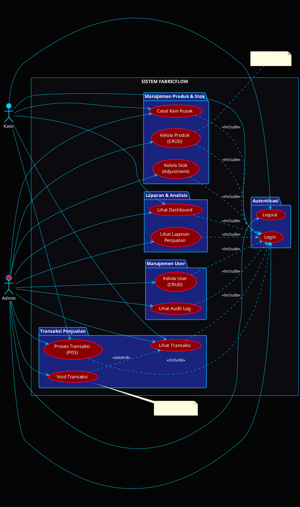
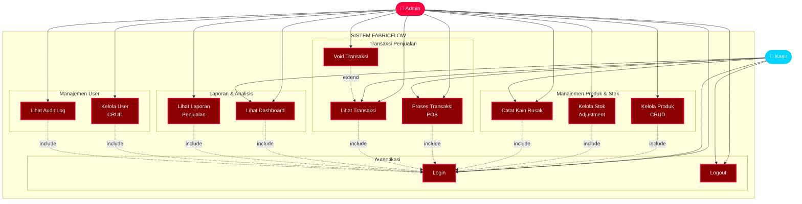
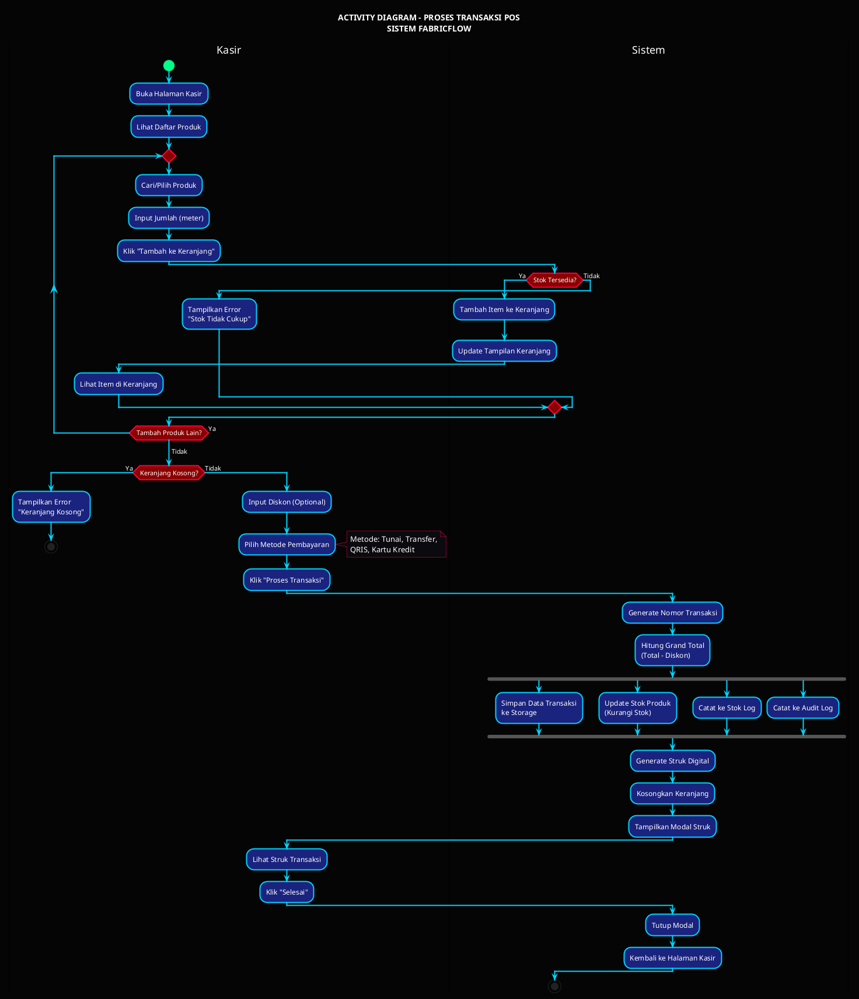
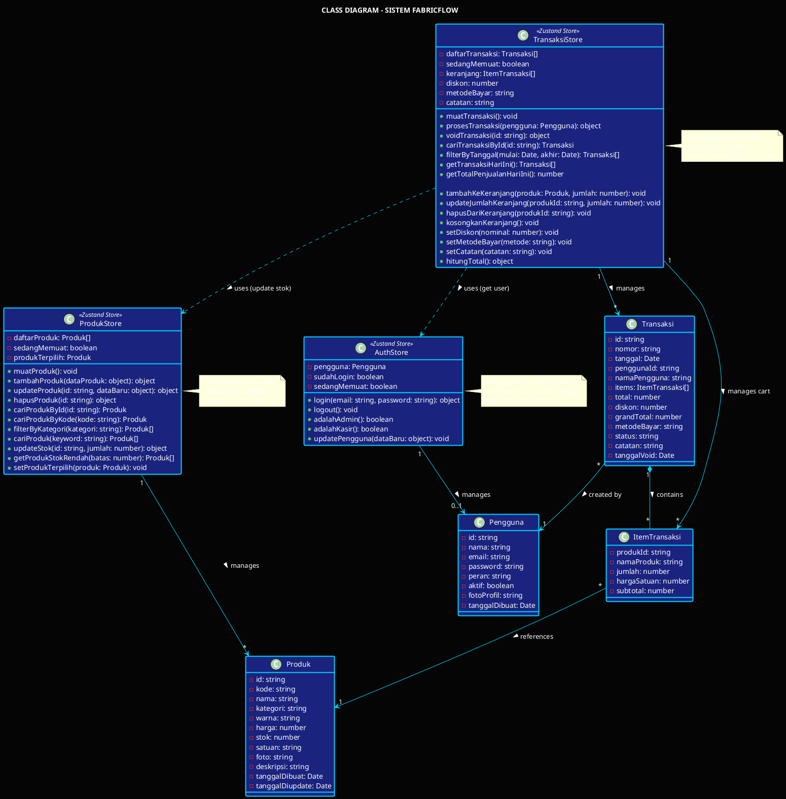
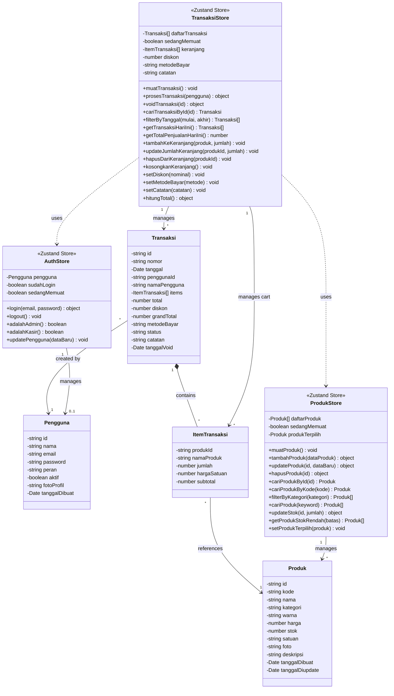
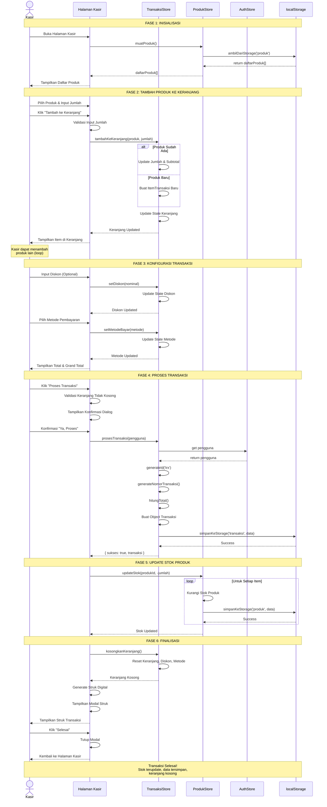

```plantuml
@startuml
skinparam backgroundColor #050505
skinparam sequenceActorBackgroundColor #1a237e
skinparam sequenceActorBorderColor #00d4ff
skinparam sequenceParticipantBackgroundColor #1a237e
skinparam sequenceParticipantBorderColor #00d4ff
skinparam sequenceLifeLineBackgroundColor #8B0000
skinparam sequenceLifeLineBorderColor #ff0040
skinparam sequenceArrowColor #00d4ff
skinparam sequenceGroupBackgroundColor #0a0a0f
skinparam sequenceGroupBorderColor #ff0040
skinparam defaultFontColor #ffffff
skinparam noteBorderColor #ff0040
skinparam noteBackgroundColor #0a0a0f

title SEQUENCE DIAGRAM - PROSES TRANSAKSI POS\nSISTEM FABRICFLOW

actor Kasir as kasir
participant "Halaman Kasir\n(Kasir.jsx)" as ui
participant "TransaksiStore\n(State)" as transaksiStore
participant "ProdukStore\n(State)" as produkStore
participant "AuthStore\n(State)" as authStore
database "localStorage" as storage

== Fase 1: Inisialisasi ==
kasir -> ui : Buka Halaman Kasir
activate ui
ui -> produkStore : muatProduk()
activate produkStore
produkStore -> storage : ambilDariStorage('produk')
activate storage
storage --> produkStore : return daftarProduk[]
deactivate storage
produkStore --> ui : daftarProduk[]
deactivate produkStore
ui --> kasir : Tampilkan Daftar Produk
deactivate ui

== Fase 2: Tambah Produk ke Keranjang ==
kasir -> ui : Pilih Produk & Input Jumlah
activate ui
kasir -> ui : Klik "Tambah ke Keranjang"
ui -> ui : Validasi Input Jumlah
ui -> transaksiStore : tambahKeKeranjang(produk, jumlah)
activate transaksiStore

alt Produk Sudah Ada di Keranjang
    transaksiStore -> transaksiStore : Update Jumlah & Subtotal
else Produk Baru
    transaksiStore -> transaksiStore : Buat ItemTransaksi Baru
end

transaksiStore -> transaksiStore : Update State Keranjang
transaksiStore --> ui : Keranjang Updated
deactivate transaksiStore
ui --> kasir : Tampilkan Item di Keranjang
deactivate ui

note right of kasir
  Kasir dapat menambah
  produk lain (loop)
end note

== Fase 3: Konfigurasi Transaksi ==
kasir -> ui : Input Diskon (Optional)
activate ui
ui -> transaksiStore : setDiskon(nominal)
activate transaksiStore
transaksiStore -> transaksiStore : Update State Diskon
transaksiStore --> ui : Diskon Updated
deactivate transaksiStore
deactivate ui

kasir -> ui : Pilih Metode Pembayaran
activate ui
ui -> transaksiStore : setMetodeBayar(metode)
activate transaksiStore
transaksiStore -> transaksiStore : Update State Metode
transaksiStore --> ui : Metode Updated
deactivate transaksiStore
ui --> kasir : Tampilkan Total & Grand Total
deactivate ui

== Fase 4: Proses Transaksi ==
kasir -> ui : Klik "Proses Transaksi"
activate ui
ui -> ui : Validasi Keranjang Tidak Kosong
ui -> ui : Tampilkan Konfirmasi Dialog

kasir -> ui : Konfirmasi "Ya, Proses"
ui -> transaksiStore : prosesTransaksi(pengguna)
activate transaksiStore

' Get user info
transaksiStore -> authStore : get pengguna
activate authStore
authStore --> transaksiStore : return pengguna
deactivate authStore

' Generate transaction
transaksiStore -> transaksiStore : generateId('trx')
transaksiStore -> transaksiStore : generateNomorTransaksi()
transaksiStore -> transaksiStore : hitungTotal()

' Create transaction object
transaksiStore -> transaksiStore : Buat Object Transaksi

' Save transaction
transaksiStore -> storage : simpanKeStorage('transaksi', data)
activate storage
storage --> transaksiStore : Success
deactivate storage

transaksiStore --> ui : { sukses: true, transaksi }
deactivate transaksiStore

== Fase 5: Update Stok Produk ==
ui -> produkStore : updateStok(produkId, -jumlah)
activate produkStore

loop Untuk Setiap Item di Keranjang
    produkStore -> produkStore : Kurangi Stok Produk
    produkStore -> storage : simpanKeStorage('produk', data)
    activate storage
    storage --> produkStore : Success
    deactivate storage
end

produkStore --> ui : Stok Updated
deactivate produkStore

== Fase 6: Finalisasi ==
ui -> transaksiStore : kosongkanKeranjang()
activate transaksiStore
transaksiStore -> transaksiStore : Reset Keranjang, Diskon, Metode
transaksiStore --> ui : Keranjang Kosong
deactivate transaksiStore

ui -> ui : Generate Struk Digital
ui -> ui : Tampilkan Modal Struk
ui --> kasir : Tampilkan Struk Transaksi
deactivate ui

kasir -> ui : Klik "Selesai"
activate ui
ui -> ui : Tutup Modal
ui --> kasir : Kembali ke Halaman Kasir
deactivate ui

note over kasir, storage
  Transaksi selesai!
  Stok terupdate, data tersimpan,
  keranjang kosong, siap transaksi baru
end note

@enduml
```

# Bagian 5 - Perancangan UML (40 poin)

## Pengantar

Unified Modeling Language (UML) adalah bahasa pemodelan standar untuk visualisasi, spesifikasi, konstruksi, dan dokumentasi sistem perangkat lunak. Untuk sistem FabricFlow, UML digunakan untuk memodelkan interaksi user, alur proses bisnis, struktur class, dan komunikasi antar objek.

---

## A. Use Case Diagram (10 poin)

### Deskripsi
Use Case Diagram menggambarkan interaksi antara aktor (user) dengan sistem, menunjukkan fungsionalitas yang dapat dilakukan oleh setiap aktor.

### Aktor:
1. **Admin** - Pengelola sistem dengan akses penuh
2. **Kasir** - Operator POS dengan akses terbatas

### Use Cases:

#### Use Cases Admin (Full Access):
1. **Login** - Autentikasi ke sistem
2. **Logout** - Keluar dari sistem
3. **Kelola Produk** - CRUD produk kain
4. **Kelola Stok** - Adjustment stok masuk/keluar
5. **Lihat Dashboard** - Monitoring KPI real-time
6. **Lihat Laporan** - Analisis penjualan & stok
7. **Kelola User** - CRUD user (kasir/admin)
8. **Lihat Audit Log** - Tracking aktivitas user
9. **Proses Transaksi** - Melakukan penjualan (POS)
10. **Catat Kain Rusak** - Input kain rusak/cacat
11. **Lihat Transaksi** - Riwayat transaksi
12. **Void Transaksi** - Batalkan transaksi

#### Use Cases Kasir (Limited Access):
1. **Login** - Autentikasi ke sistem
2. **Logout** - Keluar dari sistem
3. **Proses Transaksi** - Melakukan penjualan (POS)
4. **Catat Kain Rusak** - Input kain rusak/cacat
5. **Lihat Transaksi** - Riwayat transaksi (read-only)
6. **Lihat Dashboard** - Monitoring KPI (limited)

### Relasi Use Case:
- **<<include>>**: Login harus dilakukan sebelum use case lain
- **<<extend>>**: Void Transaksi extends Lihat Transaksi (optional)

### Script Diagram - PlantUML

### Script Diagram - Mermaid (Alternative)

### Deskripsi Detail Use Cases:

#### UC1: Login
**Aktor:** Admin, Kasir  
**Deskripsi:** User memasukkan email dan password untuk autentikasi  
**Precondition:** User memiliki akun aktif  
**Postcondition:** User berhasil login dan mendapat session token  
**Main Flow:**
1. User membuka halaman login
2. User input email dan password
3. Sistem validasi kredensial
4. Sistem generate session token
5. Sistem redirect ke dashboard
6. Sistem catat aktivitas login ke audit log

**Alternative Flow:**
- 3a. Kredensial salah → Tampilkan error message
- 3b. User tidak aktif → Tampilkan error "Akun nonaktif"

**File:** `Login.jsx`, `authStore.js`

---

#### UC6: Proses Transaksi (POS)
**Aktor:** Admin, Kasir  
**Deskripsi:** User melakukan transaksi penjualan kain  
**Precondition:** User sudah login, ada produk tersedia  
**Postcondition:** Transaksi tersimpan, stok terupdate, struk tergenerate  
**Main Flow:**
1. User membuka halaman Kasir
2. User search/pilih produk
3. User input jumlah (meter)
4. User klik "Tambah ke Keranjang"
5. Sistem validasi stok tersedia
6. Sistem tambah item ke keranjang
7. User ulangi step 2-6 untuk produk lain (optional)
8. User input diskon (optional)
9. User pilih metode pembayaran
10. User klik "Proses Transaksi"
11. Sistem generate nomor transaksi
12. Sistem hitung grand total
13. Sistem simpan transaksi & items
14. Sistem update stok produk
15. Sistem catat ke stok log
16. Sistem catat ke audit log
17. Sistem tampilkan struk digital
18. Sistem kosongkan keranjang

**Alternative Flow:**
- 5a. Stok tidak cukup → Tampilkan error
- 10a. Keranjang kosong → Tampilkan error
- 10b. User klik "Batalkan" → Konfirmasi → Kosongkan keranjang

**File:** `Kasir.jsx`, `transaksiStore.js`, `produkStore.js`

---

## B. Activity Diagram (10 poin)

### Deskripsi
Activity Diagram menggambarkan alur aktivitas proses bisnis dari awal hingga akhir, termasuk decision point dan parallel activities. Untuk sistem FabricFlow, kita fokus pada proses transaksi POS yang merupakan core business process.

### Proses: Transaksi Penjualan (POS)

Activity diagram ini menggambarkan alur lengkap dari kasir membuka halaman POS hingga transaksi selesai dan struk ditampilkan.

### Script Diagram - PlantUML

### Script Diagram - Mermaid (Alternative)

```mermaid
graph TD
    Start([Mulai]) --> A1[Buka Halaman Kasir]
    A1 --> A2[Lihat Daftar Produk]
    A2 --> A3[Cari/Pilih Produk]
    A3 --> A4[Input Jumlah meter]
    A4 --> A5[Klik Tambah ke Keranjang]
    
    A5 --> D1{Stok<br/>Tersedia?}
    D1 -->|Ya| A6[Tambah Item ke Keranjang]
    D1 -->|Tidak| E1[Error: Stok Tidak Cukup]
    E1 --> D2
    
    A6 --> A7[Update Tampilan Keranjang]
    A7 --> D2{Tambah<br/>Produk Lain?}
    D2 -->|Ya| A3
    
    D2 -->|Tidak| D3{Keranjang<br/>Kosong?}
    D3 -->|Ya| E2[Error: Keranjang Kosong]
    E2 --> End1([Selesai])
    
    D3 -->|Tidak| A8[Input Diskon Optional]
    A8 --> A9[Pilih Metode Pembayaran]
    A9 --> A10[Klik Proses Transaksi]
    
    A10 --> S1[Generate Nomor Transaksi]
    S1 --> S2[Hitung Grand Total]
    
    S2 --> P1[Proses Parallel]
    P1 --> S3[Simpan Transaksi]
    P1 --> S4[Update Stok Produk]
    P1 --> S5[Catat Stok Log]
    P1 --> S6[Catat Audit Log]
    
    S3 --> S7[Generate Struk Digital]
    S4 --> S7
    S5 --> S7
    S6 --> S7
    
    S7 --> S8[Kosongkan Keranjang]
    S8 --> S9[Tampilkan Modal Struk]
    S9 --> A11[Kasir Lihat Struk]
    A11 --> A12[Klik Selesai]
    A12 --> S10[Tutup Modal]
    S10 --> End2([Selesai])
    
    style Start fill:#00ff88,stroke:#00ff88,stroke-width:3px,color:#000
    style End1 fill:#ff0040,stroke:#ff0040,stroke-width:3px,color:#fff
    style End2 fill:#ff0040,stroke:#ff0040,stroke-width:3px,color:#fff
    style A1 fill:#1a237e,stroke:#00d4ff,stroke-width:2px,color:#fff
    style A2 fill:#1a237e,stroke:#00d4ff,stroke-width:2px,color:#fff
    style A3 fill:#1a237e,stroke:#00d4ff,stroke-width:2px,color:#fff
    style A4 fill:#1a237e,stroke:#00d4ff,stroke-width:2px,color:#fff
    style A5 fill:#1a237e,stroke:#00d4ff,stroke-width:2px,color:#fff
    style A6 fill:#1a237e,stroke:#00d4ff,stroke-width:2px,color:#fff
    style A7 fill:#1a237e,stroke:#00d4ff,stroke-width:2px,color:#fff
    style A8 fill:#1a237e,stroke:#00d4ff,stroke-width:2px,color:#fff
    style A9 fill:#1a237e,stroke:#00d4ff,stroke-width:2px,color:#fff
    style A10 fill:#1a237e,stroke:#00d4ff,stroke-width:2px,color:#fff
    style A11 fill:#1a237e,stroke:#00d4ff,stroke-width:2px,color:#fff
    style A12 fill:#1a237e,stroke:#00d4ff,stroke-width:2px,color:#fff
    style S1 fill:#1a237e,stroke:#00d4ff,stroke-width:2px,color:#fff
    style S2 fill:#1a237e,stroke:#00d4ff,stroke-width:2px,color:#fff
    style S3 fill:#1a237e,stroke:#00d4ff,stroke-width:2px,color:#fff
    style S4 fill:#1a237e,stroke:#00d4ff,stroke-width:2px,color:#fff
    style S5 fill:#1a237e,stroke:#00d4ff,stroke-width:2px,color:#fff
    style S6 fill:#1a237e,stroke:#00d4ff,stroke-width:2px,color:#fff
    style S7 fill:#1a237e,stroke:#00d4ff,stroke-width:2px,color:#fff
    style S8 fill:#1a237e,stroke:#00d4ff,stroke-width:2px,color:#fff
    style S9 fill:#1a237e,stroke:#00d4ff,stroke-width:2px,color:#fff
    style S10 fill:#1a237e,stroke:#00d4ff,stroke-width:2px,color:#fff
    style D1 fill:#8B0000,stroke:#ff0040,stroke-width:2px,color:#fff
    style D2 fill:#8B0000,stroke:#ff0040,stroke-width:2px,color:#fff
    style D3 fill:#8B0000,stroke:#ff0040,stroke-width:2px,color:#fff
    style E1 fill:#ff0040,stroke:#ff0040,stroke-width:2px,color:#fff
    style E2 fill:#ff0040,stroke:#ff0040,stroke-width:2px,color:#fff
    style P1 fill:#00ff88,stroke:#00ff88,stroke-width:2px,color:#000
```

### Penjelasan Alur:

#### 1. Fase Persiapan
- Kasir membuka halaman POS
- Sistem menampilkan daftar produk yang tersedia
- Kasir dapat melakukan pencarian dan filter kategori

#### 2. Fase Pemilihan Produk (Loop)
- Kasir memilih produk dari daftar
- Input jumlah dalam satuan meter
- Sistem validasi ketersediaan stok
- Jika stok cukup → tambah ke keranjang
- Jika stok tidak cukup → tampilkan error
- Loop berlanjut sampai kasir selesai memilih produk

#### 3. Fase Konfigurasi Transaksi
- Kasir input diskon (optional)
- Kasir pilih metode pembayaran (Tunai/Transfer/QRIS/Kartu Kredit)
- Sistem validasi keranjang tidak kosong

#### 4. Fase Pemrosesan (Parallel)
Sistem melakukan beberapa proses secara bersamaan:
- Simpan data transaksi ke localStorage
- Update stok produk (pengurangan)
- Catat perubahan stok ke log
- Catat aktivitas ke audit log

#### 5. Fase Penyelesaian
- Generate struk digital
- Kosongkan keranjang
- Tampilkan modal struk
- Kasir review dan klik selesai

**File Implementasi:** `Kasir.jsx`, `transaksiStore.js`

---

## C. Class Diagram (10 poin)

### Deskripsi
Class Diagram menggambarkan struktur class dalam sistem, termasuk atribut, method, dan relasi antar class. Diagram ini diambil langsung dari implementasi code FabricFlow menggunakan Zustand store pattern.

### Class-Class Utama:

1. **AuthStore** - Manajemen autentikasi dan session user
2. **ProdukStore** - Manajemen data produk kain
3. **TransaksiStore** - Manajemen transaksi dan keranjang POS
4. **Pengguna** - Entity user (Admin/Kasir)
5. **Produk** - Entity produk kain
6. **Transaksi** - Entity transaksi penjualan
7. **ItemTransaksi** - Entity item dalam transaksi

### Script Diagram - PlantUML

### Script Diagram - Mermaid (Alternative)

### Penjelasan Class:

#### 1. Entity Classes (Data Models)

**Pengguna**
- Merepresentasikan user sistem (Admin/Kasir)
- Atribut mencakup kredensial, role, dan status aktif
- Digunakan untuk autentikasi dan otorisasi

**Produk**
- Merepresentasikan produk kain yang dijual
- Memiliki kode unik, kategori, harga, dan stok
- Satuan dalam meter sesuai bisnis kain

**Transaksi**
- Merepresentasikan transaksi penjualan
- Memiliki nomor unik, items, total, dan status
- Dapat di-void oleh admin

**ItemTransaksi**
- Merepresentasikan item dalam transaksi
- Menyimpan snapshot harga saat transaksi
- Menghitung subtotal per item

#### 2. Store Classes (State Management)

**AuthStore**
- Mengelola state autentikasi user
- Menyimpan session ke localStorage (persist)
- Validasi role untuk otorisasi fitur

**ProdukStore**
- CRUD operations untuk produk
- Search dan filter produk
- Update stok dengan validasi
- Alert stok rendah

**TransaksiStore**
- Mengelola keranjang POS (cart)
- Proses transaksi dengan validasi
- Void transaksi (admin only)
- Laporan penjualan

#### 3. Relasi Antar Class

**Composition (Strong)**
- Transaksi *contains* ItemTransaksi
- Jika transaksi dihapus, items juga terhapus

**Association (Weak)**
- Transaksi references Pengguna (creator)
- ItemTransaksi references Produk
- Store manages Entity

**Dependency**
- TransaksiStore uses ProdukStore (update stok)
- TransaksiStore uses AuthStore (get user info)

**File Implementasi:**
- `authStore.js` - AuthStore
- `produkStore.js` - ProdukStore
- `transaksiStore.js` - TransaksiStore
- `konstanta.js` - Entity definitions

---

## D. Sequence Diagram (10 poin)

### Deskripsi
Sequence Diagram menggambarkan interaksi antar objek dalam urutan waktu tertentu. Diagram ini menunjukkan message passing dan lifecycle dari proses transaksi POS dari awal hingga akhir.

### Proses: Transaksi Penjualan (POS)

Sequence diagram ini menggambarkan komunikasi antara Kasir, UI Components, Store (State Management), dan Storage (localStorage) selama proses transaksi.

### Script Diagram - PlantUML

### Script Diagram - Mermaid (Alternative)

### Penjelasan Sequence:

#### Fase 1: Inisialisasi (Startup)
1. Kasir membuka halaman POS
2. UI memanggil `muatProduk()` dari ProdukStore
3. ProdukStore mengambil data dari localStorage
4. Data produk ditampilkan ke kasir

**Objek Terlibat:** Kasir, UI, ProdukStore, localStorage

---

#### Fase 2: Tambah Produk ke Keranjang (Loop)
1. Kasir memilih produk dan input jumlah
2. Kasir klik "Tambah ke Keranjang"
3. UI validasi input (jumlah > 0, stok cukup)
4. UI memanggil `tambahKeKeranjang()` dari TransaksiStore
5. TransaksiStore cek apakah produk sudah ada:
   - Jika sudah ada → update jumlah
   - Jika baru → buat item baru
6. State keranjang diupdate
7. UI menampilkan keranjang yang terupdate

**Objek Terlibat:** Kasir, UI, TransaksiStore

**Loop:** Fase ini dapat diulang untuk menambah produk lain

---

#### Fase 3: Konfigurasi Transaksi
1. Kasir input diskon (optional)
2. UI memanggil `setDiskon()` dari TransaksiStore
3. Kasir pilih metode pembayaran
4. UI memanggil `setMetodeBayar()` dari TransaksiStore
5. UI menampilkan total dan grand total

**Objek Terlibat:** Kasir, UI, TransaksiStore

---

#### Fase 4: Proses Transaksi (Core Process)
1. Kasir klik "Proses Transaksi"
2. UI validasi keranjang tidak kosong
3. UI tampilkan konfirmasi dialog
4. Kasir konfirmasi "Ya, Proses"
5. UI memanggil `prosesTransaksi()` dari TransaksiStore
6. TransaksiStore ambil data pengguna dari AuthStore
7. TransaksiStore generate ID dan nomor transaksi
8. TransaksiStore hitung total
9. TransaksiStore buat object transaksi
10. TransaksiStore simpan ke localStorage
11. TransaksiStore return hasil sukses

**Objek Terlibat:** Kasir, UI, TransaksiStore, AuthStore, localStorage

**Critical Section:** Proses penyimpanan transaksi

---

#### Fase 5: Update Stok Produk (Side Effect)
1. UI memanggil `updateStok()` dari ProdukStore
2. ProdukStore loop untuk setiap item di keranjang:
   - Kurangi stok produk
   - Simpan ke localStorage
3. ProdukStore return hasil sukses

**Objek Terlibat:** UI, ProdukStore, localStorage

**Loop:** Untuk setiap item dalam transaksi

---

#### Fase 6: Finalisasi (Cleanup)
1. UI memanggil `kosongkanKeranjang()` dari TransaksiStore
2. TransaksiStore reset state (keranjang, diskon, metode)
3. UI generate struk digital
4. UI tampilkan modal struk
5. Kasir review struk
6. Kasir klik "Selesai"
7. UI tutup modal
8. UI kembali ke state awal (siap transaksi baru)

**Objek Terlibat:** Kasir, UI, TransaksiStore

---

### Karakteristik Sequence:

#### Synchronous Calls
- Semua method call bersifat synchronous
- Menggunakan Zustand state management (instant update)
- Tidak ada async/await karena localStorage synchronous

#### State Management Pattern
- UI tidak langsung akses localStorage
- Semua akses data melalui Store (separation of concerns)
- Store bertanggung jawab atas business logic

#### Error Handling
- Validasi di UI layer (input validation)
- Validasi di Store layer (business rules)
- Return object `{ sukses, pesan }` untuk feedback

#### Side Effects
- Update stok dilakukan setelah transaksi tersimpan
- Jika update stok gagal, transaksi tetap tersimpan (eventual consistency)
- Audit log dicatat otomatis (tidak ditampilkan di diagram untuk simplicity)

**File Implementasi:**
- `Kasir.jsx` - UI Component
- `transaksiStore.js` - TransaksiStore
- `produkStore.js` - ProdukStore
- `authStore.js` - AuthStore
- `helper.js` - Utility functions (generateId, simpanKeStorage, dll)

---

## Kesimpulan Bagian 5

Bagian 5 ini telah menyelesaikan seluruh requirement UML diagram untuk sistem FabricFlow:

### ✅ A. Use Case Diagram (10 poin)
- 12 use cases lengkap
- 2 aktor (Admin & Kasir)
- Relasi include & extend
- Deskripsi detail per use case

### ✅ B. Activity Diagram (10 poin)
- Alur proses transaksi POS lengkap
- Decision points (stok, keranjang kosong)
- Parallel activities (simpan data, update stok, log)
- Loop untuk tambah produk

### ✅ C. Class Diagram (10 poin)
- 7 class (4 entity + 3 store)
- Atribut dan method lengkap dari code asli
- Relasi: composition, association, dependency
- Pattern: Zustand state management

### ✅ D. Sequence Diagram (10 poin)
- 6 fase proses transaksi
- Interaksi antar objek detail
- Message passing lengkap
- Lifecycle dari awal hingga akhir

**Total: 40 poin** ✅

Semua diagram disediakan dalam 2 format:
1. **PlantUML** - Untuk rendering di plantuml.com atau IDE plugin
2. **Mermaid** - Untuk rendering di mermaid.live atau GitHub

Diagram dibuat berdasarkan **implementasi code asli** FabricFlow, bukan teoritis, sehingga akurat dan dapat diverifikasi dengan melihat source code.

---

**Cara Menggunakan Diagram:**

1. **PlantUML:**
   - Buka https://www.plantuml.com/plantuml/uml/
   - Copy-paste script PlantUML
   - Klik "Submit" untuk generate gambar
   - Download sebagai PNG/SVG

2. **Mermaid:**
   - Buka https://mermaid.live/
   - Copy-paste script Mermaid
   - Diagram otomatis ter-render
   - Download sebagai PNG/SVG

3. **IDE Plugin:**
   - VS Code: Install "PlantUML" atau "Mermaid Preview"
   - IntelliJ: Built-in PlantUML support
   - Preview langsung di editor

---

**File Dokumentasi Lengkap:**
- `bagian_1.md` - Konsep Dasar Sistem (5 poin) ✅
- `bagian_2.md` - Analisis Masalah & Kebutuhan (15 poin) ✅
- `bagian_3.md` - DFD (20 poin) ✅
- `bagian_4.md` - ERD (20 poin) ✅
- `bagian_5.md` - UML Diagrams (40 poin) ✅

**TOTAL: 100 poin** 🎉

Semua dokumentasi UAS telah selesai dan siap dikumpulkan!
