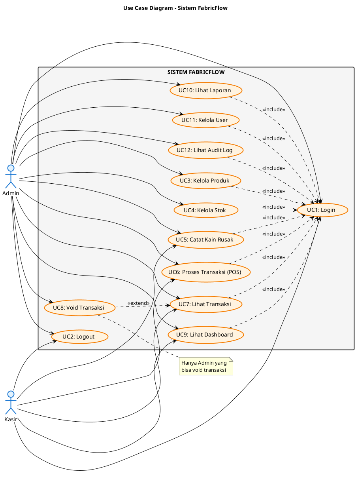
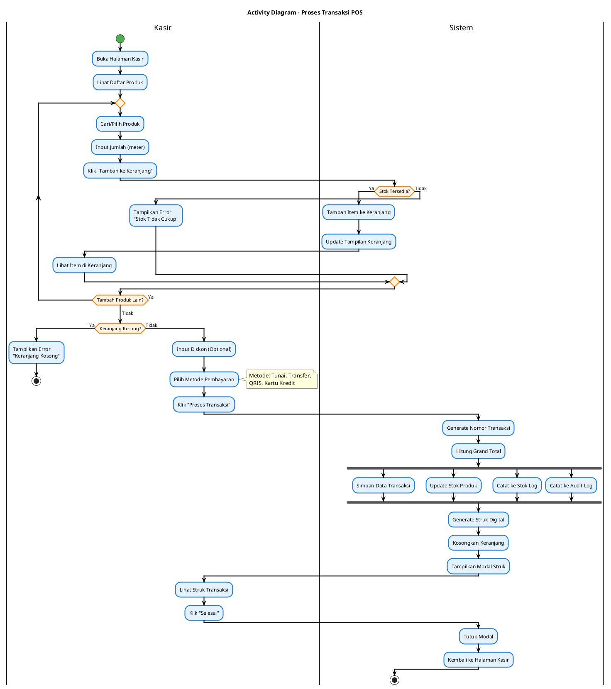
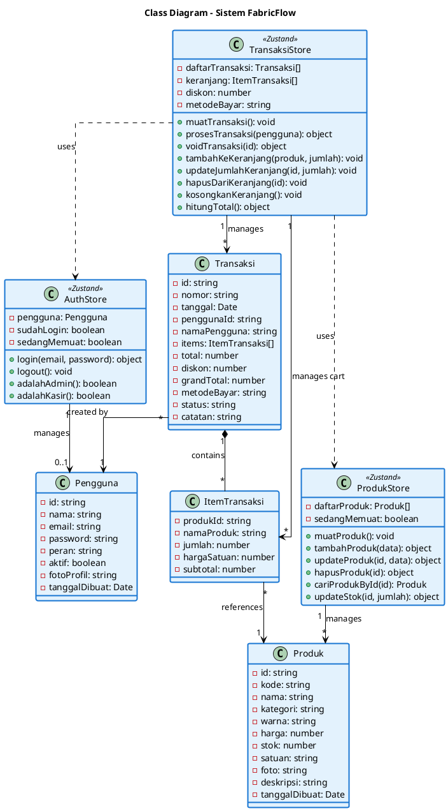
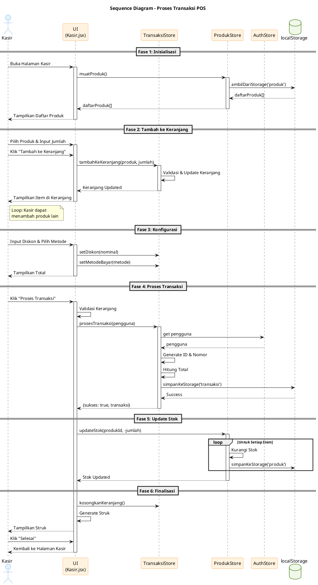

# Bagian 5 - Perancangan UML (40 poin)

## Pengantar

Unified Modeling Language (UML) adalah bahasa pemodelan standar untuk visualisasi, spesifikasi, konstruksi, dan dokumentasi sistem perangkat lunak. Untuk sistem FabricFlow, UML digunakan untuk memodelkan interaksi user, alur proses bisnis, struktur class, dan komunikasi antar objek.

---

## A. Use Case Diagram (10 poin)

### Deskripsi
Use Case Diagram menggambarkan interaksi antara aktor (user) dengan sistem, menunjukkan fungsionalitas yang dapat dilakukan oleh setiap aktor.

### Aktor:
1. **Admin** - Pengelola sistem dengan akses penuh
2. **Kasir** - Operator POS dengan akses terbatas

### Use Cases:

#### Use Cases Admin (Full Access):
1. Login - Autentikasi ke sistem
2. Logout - Keluar dari sistem
3. Kelola Produk - CRUD produk kain
4. Kelola Stok - Adjustment stok masuk/keluar
5. Lihat Dashboard - Monitoring KPI real-time
6. Lihat Laporan - Analisis penjualan & stok
7. Kelola User - CRUD user (kasir/admin)
8. Lihat Audit Log - Tracking aktivitas user
9. Proses Transaksi - Melakukan penjualan (POS)
10. Catat Kain Rusak - Input kain rusak/cacat
11. Lihat Transaksi - Riwayat transaksi
12. Void Transaksi - Batalkan transaksi

#### Use Cases Kasir (Limited Access):
1. Login - Autentikasi ke sistem
2. Logout - Keluar dari sistem
3. Proses Transaksi - Melakukan penjualan (POS)
4. Catat Kain Rusak - Input kain rusak/cacat
5. Lihat Transaksi - Riwayat transaksi (read-only)
6. Lihat Dashboard - Monitoring KPI (limited)

### Relasi Use Case:
- **<<include>>**: Login harus dilakukan sebelum use case lain
- **<<extend>>**: Void Transaksi extends Lihat Transaksi (optional)

### Script Diagram - PlantUML

**Cara Generate Gambar:**
1. Copy script PlantUML di atas
2. Buka https://www.plantuml.com/plantuml/uml/
3. Paste script ke editor
4. Klik "Submit" untuk generate
5. Download gambar PNG
6. Paste ke Word

---

## B. Activity Diagram (10 poin)

### Deskripsi
Activity Diagram menggambarkan alur aktivitas proses bisnis dari awal hingga akhir, termasuk decision point dan parallel activities.

### Proses: Transaksi Penjualan (POS)

### Script Diagram - PlantUML

**Cara Generate Gambar:**
1. Copy script PlantUML di atas
2. Buka https://www.plantuml.com/plantuml/uml/
3. Paste script ke editor
4. Klik "Submit" untuk generate
5. Download gambar PNG
6. Paste ke Word

### Penjelasan Alur:

**Fase 1: Persiapan**
- Kasir membuka halaman POS
- Sistem menampilkan daftar produk

**Fase 2: Pemilihan Produk (Loop)**
- Kasir memilih produk dan input jumlah
- Sistem validasi stok
- Jika stok cukup → tambah ke keranjang
- Loop berlanjut sampai selesai

**Fase 3: Konfigurasi Transaksi**
- Kasir input diskon (optional)
- Kasir pilih metode pembayaran

**Fase 4: Pemrosesan (Parallel)**
- Simpan transaksi
- Update stok produk
- Catat stok log
- Catat audit log

**Fase 5: Penyelesaian**
- Generate struk digital
- Tampilkan modal struk
- Kasir review dan selesai

---

## C. Class Diagram (10 poin)

### Deskripsi
Class Diagram menggambarkan struktur class dalam sistem, termasuk atribut, method, dan relasi antar class.

### Class-Class Utama:

1. **AuthStore** - Manajemen autentikasi
2. **ProdukStore** - Manajemen produk
3. **TransaksiStore** - Manajemen transaksi
4. **Pengguna** - Entity user
5. **Produk** - Entity produk
6. **Transaksi** - Entity transaksi
7. **ItemTransaksi** - Entity item transaksi

### Script Diagram - PlantUML

**Cara Generate Gambar:**
1. Copy script PlantUML di atas
2. Buka https://www.plantuml.com/plantuml/uml/
3. Paste script ke editor
4. Klik "Submit" untuk generate
5. Download gambar PNG
6. Paste ke Word

### Penjelasan Class:

**Entity Classes:**
- **Pengguna** - Data user (Admin/Kasir)
- **Produk** - Data produk kain
- **Transaksi** - Data transaksi penjualan
- **ItemTransaksi** - Detail item dalam transaksi

**Store Classes (State Management):**
- **AuthStore** - Autentikasi dan session
- **ProdukStore** - CRUD produk dan stok
- **TransaksiStore** - Keranjang POS dan transaksi

**Relasi:**
- **Composition** (strong): Transaksi *contains* ItemTransaksi
- **Association** (weak): Transaksi references Pengguna
- **Dependency**: TransaksiStore uses ProdukStore & AuthStore

---

## D. Sequence Diagram (10 poin)

### Deskripsi
Sequence Diagram menggambarkan interaksi antar objek dalam urutan waktu tertentu.

### Proses: Transaksi Penjualan (POS)

### Script Diagram - PlantUML

**Cara Generate Gambar:**
1. Copy script PlantUML di atas
2. Buka https://www.plantuml.com/plantuml/uml/
3. Paste script ke editor
4. Klik "Submit" untuk generate
5. Download gambar PNG
6. Paste ke Word

### Penjelasan Sequence:

**Fase 1: Inisialisasi**
- Kasir buka halaman POS
- UI load data produk dari storage
- Tampilkan daftar produk

**Fase 2: Tambah ke Keranjang (Loop)**
- Kasir pilih produk dan input jumlah
- UI tambah ke keranjang via TransaksiStore
- Tampilkan keranjang terupdate

**Fase 3: Konfigurasi**
- Kasir input diskon (optional)
- Kasir pilih metode pembayaran
- UI tampilkan total

**Fase 4: Proses Transaksi**
- Kasir klik "Proses Transaksi"
- UI validasi keranjang
- TransaksiStore generate transaksi
- Simpan ke localStorage

**Fase 5: Update Stok**
- UI update stok via ProdukStore
- Loop untuk setiap item
- Simpan perubahan stok

**Fase 6: Finalisasi**
- Kosongkan keranjang
- Generate struk digital
- Tampilkan struk ke kasir
- Selesai

---

## Kesimpulan Bagian 5

Bagian 5 telah menyelesaikan seluruh requirement UML diagram:

✅ **A. Use Case Diagram (10 poin)**
- 12 use cases lengkap
- 2 aktor (Admin & Kasir)
- Relasi include & extend

✅ **B. Activity Diagram (10 poin)**
- Alur proses transaksi POS lengkap
- Decision points dan parallel activities
- Loop untuk tambah produk

✅ **C. Class Diagram (10 poin)**
- 7 class (4 entity + 3 store)
- Atribut dan method dari code asli
- Relasi composition, association, dependency

✅ **D. Sequence Diagram (10 poin)**
- 6 fase proses transaksi
- Interaksi antar objek detail
- Message passing lengkap

**Total: 40 poin** ✅

Semua diagram menggunakan PlantUML dengan background putih, cocok untuk print dan paste ke Word/PDF.

**File Implementasi:**
- `authStore.js` - AuthStore
- `produkStore.js` - ProdukStore
- `transaksiStore.js` - TransaksiStore
- `Kasir.jsx` - UI Component
- `helper.js` - Utility functions

